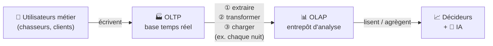

# 🎓 Fiche de cours — OLTP & OLAP : de quoi parle-t-on, et pourquoi ?

> **Fiche de contexte.** Avant d'entrer dans le « comment on modélise » (voir les fiches [`OLTP.md`](./OLTP.md) et [`OLAP.md`](./OLAP.md)), ce document répond aux vraies questions de fond : **quand** utilise-t-on l'un ou l'autre ? **pour quoi faire** ? **quels bénéfices** ? et **à qui** montre-t-on tout ça ? Rattaché au bloc **BC05** — voir [`TRACABILITE-COMPETENCES.md`](./TRACABILITE-COMPETENCES.md).

## Les mots d'abord : que signifient ces sigles ?

Les deux termes sont des acronymes anglais qui décrivent **deux façons d'utiliser une base de données** :

* **OLTP** = ***O**n**L**ine **T**ransaction **P**rocessing* → « traitement transactionnel en ligne ». Le mot important est **transaction** : chaque petite opération métier (une signature, un paiement) est une transaction enregistrée immédiatement.
* **OLAP** = ***O**n**L**ine **A**nalytical **P**rocessing* → « traitement analytique en ligne ». Le mot important est **analytique** : on lit et on agrège de grandes quantités de données pour analyser.

> Deux autres sigles reviennent souvent dans ces fiches :
> * **SGBD** = Système de Gestion de Base de Données (MySQL, PostgreSQL… le logiciel qui stocke et interroge les données).
> * **ETL** = *Extract, Transform, Load* (Extraire, Transformer, Charger) → la **logique** de recopie des données de l'OLTP vers l'OLAP. Ce n'est pas un logiciel obligatoire : un script SQL suffit.

## Ce n'est pas une méthode, c'est une manière d'organiser les données

Attention à une confusion fréquente : **OLTP et OLAP ne sont ni des logiciels, ni des méthodes de gestion de projet** (contrairement à une SWOT ou une RACI, qui sont des outils d'analyse). Ce sont des **profils d'usage d'une base de données** :

* une même donnée peut vivre dans une base **organisée pour l'OLTP** (écrire vite et juste) **ou** dans une base **organisée pour l'OLAP** (lire et agréger vite) ;
* le même SGBD (ex. PostgreSQL) peut héberger l'une ou l'autre — ce qui change, c'est **la façon dont on modélise les tables** et **ce qu'on en fait**.

> En clair : « faire de l'OLTP » = concevoir et exploiter une base pour le métier au quotidien. « Faire de l'OLAP » = concevoir et exploiter une base pour l'analyse. Les fiches [`OLTP.md`](./OLTP.md) et [`OLAP.md`](./OLAP.md) montrent comment on modélise chacune.

---
## L'histoire en une image

Une entreprise, c'est deux temps différents :

* **Le temps de l'action** — on signe un mandat, on enregistre un paiement, on ajoute un commentaire. Chaque geste doit être enregistré **immédiatement et sans erreur**. → C'est le monde **OLTP**.
* **Le temps de la réflexion** — en fin de trimestre, on veut savoir qui performe, où sont les zones rentables, comment évolue le délai moyen de vente. On **agrège tout l'historique** pour décider. → C'est le monde **OLAP**.

> 🧠 **La phrase à retenir :** *l'OLTP fait tourner l'entreprise, l'OLAP aide à la piloter.* Ce ne sont pas deux technologies concurrentes, mais deux moments complémentaires de la vie de la donnée.

---

## Quand utilise-t-on l'un ? l'autre ?

| Situation réelle | Monde concerné |
| --- | --- |
| Un chasseur signe un mandat dans l'appli | **OLTP** (écriture immédiate) |
| Un client consulte ses biens proposés | **OLTP** (lecture ciblée, quelques lignes) |
| On enregistre un paiement chez le notaire | **OLTP** (transaction, intégrité critique) |
| Le directeur veut le CA par secteur sur 2 ans | **OLAP** (agrégation massive) |
| On compare la performance des chasseurs par trimestre | **OLAP** (analyse multi-axes) |
| On entraîne une IA de matching bien/demande | **OLAP** (lecture de gros volumes, sans gêner la prod) |

> Règle simple : **une écriture métier ou une lecture ciblée → OLTP. Une analyse qui balaie l'historique → OLAP.**

---

## Pour quoi faire ? (les usages)

### OLTP — faire fonctionner le métier
* Enregistrer chaque acte métier de façon fiable et immédiate.
* Garantir l'intégrité (un paiement n'est jamais à moitié enregistré).
* Servir l'application au quotidien : le site, l'appli des chasseurs, l'espace client.

### OLAP — éclairer les décisions
* Produire les **tableaux de bord** et **rapports** de pilotage.
* Répondre aux questions stratégiques (rentabilité, tendances, performance).
* **Alimenter l'IA** : un modèle de scoring ou de matching lit un entrepôt propre, pas la base de production.

---

## Quels bénéfices ? (pourquoi les séparer)

> Le vrai enjeu n'est pas « OLTP ou OLAP » mais **pourquoi on ne fait pas tout dans une seule base**.

* **Performance préservée.** Une grosse analyse sur 2 ans d'historique, lancée sur la base de production, la ralentirait pour tout le monde. En isolant l'analytique dans l'OLAP, **le métier n'est jamais pénalisé**.
* **Modèles adaptés à chaque usage.** L'OLTP est normalisé (rapide à écrire, intègre) ; l'OLAP est dénormalisé (rapide à lire/agréger). Chaque base est optimisée pour ce qu'elle fait.
* **Sécurité et souveraineté.** L'OLAP peut être anonymisé/pseudonymisé avant d'être exposé à des outils tiers ou à une IA. On ne branche jamais un LLM directement sur la base client de production.
* **Scalabilité.** Quand l'entreprise passe à des milliers de mandats/semaine à l'international, les deux mondes peuvent grandir séparément, avec des dimensionnements différents.
* **Clarté organisationnelle.** Les équipes métier écrivent dans l'OLTP ; les analystes et data scientists lisent l'OLAP. Les rôles sont nets.

---

## Comment ils travaillent ensemble

> L'OLTP capte la réalité au fil de l'eau ; un rafraîchissement périodique la recopie et la transforme vers l'OLAP ; décideurs et IA exploitent l'OLAP **sans jamais toucher à la production**. Le détail de cette alimentation est dans [`OLAP.md`](./OLAP.md).

---

## À quel moment du fil rouge s'y met-on ?

Ces notions n'arrivent pas n'importe quand dans le projet. Voici le fil :

| Phase du fil rouge | Ce qu'on fait côté OLTP / OLAP |
| --- | --- |
| **Phase 1 — Audit** | On constate que l'existant (`Fil_Rouge_Depart`) est une base **OLTP** mal fichue. On ne parle pas encore d'OLAP : on diagnostique. |
| **Phase 2 — Besoin actuel** | On **conçoit le modèle OLTP cible** (clients, chasseurs, mandats, biens, paiements… normalisés). C'est le cœur du travail transactionnel. |
| **Phase 3 — Croissance** | On **introduit l'OLAP** : puisque le volume explose et qu'on veut piloter, on conçoit un entrepôt analytique séparé, alimenté depuis l'OLTP. C'est ICI que la distinction devient concrète. |
| **Phase 4 — IA** | L'OLAP prend tout son sens : le modèle d'IA (matching, scoring) **lit l'OLAP**, jamais la base de production. |

> 👉 Retenez : **l'OLTP se conçoit dès la Phase 2** (c'est votre base métier), **l'OLAP apparaît en Phase 3** (quand le besoin d'analyse et de volume le justifie). Concevoir un OLAP avant d'avoir un OLTP solide n'aurait aucun sens : l'OLAP se nourrit de l'OLTP.

---

## Méthode pas à pas : comment mener et maintenir ces modèles

### La source de vérité

> **Point fondamental :** la **source de vérité, c'est toujours l'OLTP.** L'OLAP n'invente rien : c'est une copie transformée. Si les deux se contredisent, c'est l'OLTP qui a raison. On ne corrige jamais une donnée directement dans l'OLAP — on corrige dans l'OLTP, et le prochain rafraîchissement propage la correction.

### Étapes pour construire l'OLTP (Phase 2)

1. **Partir des besoins métier** : lister les actes que l'entreprise réalise (signer, commenter, payer…). Chaque acte = une écriture à prévoir.
2. **Identifier les entités** (clients, chasseurs, mandats, biens…) et leurs relations.
3. **Normaliser** : chaque information à un seul endroit, les liens par clés étrangères (voir [`OLTP.md`](./OLTP.md)).
4. **Poser les contraintes** (clés, unicité, règles métier comme « date_fin = signature + 6 mois »).
5. **Valider** en rejouant les transactions métier : le modèle encaisse-t-il tous les actes du parcours utilisateur ?

### Étapes pour construire l'OLAP (Phase 3)

1. **Partir d'une question de pilotage** (« performance par chasseur et par trimestre ? »). L'OLAP se conçoit **à partir des questions**, pas des données brutes.
2. **Définir le grain** : que représente une ligne de la table de faits ? (ex. une vente). C'est la décision la plus structurante.
3. **Identifier les mesures** (les nombres à analyser : montant, commission, délai…) et les **dimensions** (les axes : temps, chasseur, secteur…).
4. **Dessiner le schéma en étoile** (voir [`OLAP.md`](./OLAP.md)).
5. **Écrire l'alimentation** depuis l'OLTP (extraire → transformer → charger), par exemple un `INSERT ... SELECT`.
6. **Choisir la fréquence de rafraîchissement** (ex. chaque nuit) — à arbitrer avec l'éco-conception.

### Comment on les maintient à jour

* **L'OLTP se maintient en continu**, par l'application elle-même : chaque acte métier l'actualise en temps réel. La maintenance porte surtout sur l'évolution du **schéma** (nouvelle fonctionnalité = nouvelles tables/colonnes, via des migrations).
* **L'OLAP se maintient par rafraîchissements périodiques** : le processus d'alimentation rejoue régulièrement l'extraction depuis l'OLTP. On surveille : le rafraîchissement a-t-il tourné ? les volumes sont-ils cohérents ? faut-il de nouvelles dimensions si le métier évolue ?
* **À partir de quoi observe-t-on qu'une mise à jour est nécessaire ?**
  * un **nouveau besoin métier** (nouvel acte à enregistrer) → faire évoluer l'**OLTP** ;
  * une **nouvelle question de pilotage** (nouvel axe d'analyse) → faire évoluer l'**OLAP** (nouvelle dimension ou mesure) ;
  * un **écart** entre un rapport OLAP et la réalité OLTP → vérifier le processus d'alimentation, jamais « patcher » l'OLAP à la main.

> 🧭 **Boussole :** on construit toujours **OLTP d'abord, OLAP ensuite** ; on corrige toujours **dans l'OLTP**, jamais dans l'OLAP ; et on fait évoluer chacun **en réponse à une observation** (nouveau besoin métier, nouvelle question, ou incohérence détectée).

---
## Pour montrer à qui ? (les destinataires)

> Question clé pour ce projet : un schéma ne se présente pas de la même façon selon l'interlocuteur. Adaptez le niveau.

| Destinataire | Ce qui l'intéresse | Comment lui présenter |
| --- | --- | --- |
| **Le patron / commanditaire** | « à quoi ça sert, qu'est-ce que ça rapporte ? » | Le schéma de flux OLTP→OLAP + les **bénéfices métier** (performance, pilotage, IA possible). Pas de détail technique. |
| **Un développeur / la future équipe** | « comment c'est structuré, comment j'écris dessus ? » | Le **MCD OLTP** normalisé, les contraintes, les tables et clés. |
| **Un analyste / data scientist** | « comment j'interroge l'historique, quel grain ? » | Le **schéma en étoile OLAP**, les faits, les dimensions, les mesures. |
| **Le jury (RNCP40573)** | « comprenez-vous *pourquoi* ces choix ? » | Les deux, **plus la justification** : pourquoi séparer, quels arbitrages (perf, RGPD, éco-conception). |

> ⚠️ Pour le jury, savoir dessiner un schéma ne suffit pas : il faut **défendre le raisonnement**. Pourquoi un OLAP séparé ? Pourquoi ce grain ? Quel coût de stockage, quelle fréquence de rafraîchissement (lien avec l'éco-conception) ? C'est là que se joue la validation.

---

## En résumé

* **OLTP** = le présent, l'écriture, le métier qui tourne. Normalisé, fiable, temps réel.
* **OLAP** = le recul, la lecture massive, la décision et l'IA. Dénormalisé, rapide à agréger, rafraîchi périodiquement.
* On les **sépare** pour ne pas pénaliser le métier, adapter chaque modèle à son usage, et sécuriser les données.
* On **relie** l'un à l'autre par une alimentation périodique (extraire → transformer → charger).
* On **présente** chaque schéma au bon niveau selon l'interlocuteur — et au jury, on **justifie** toujours.

> ▶️ Pour la modélisation détaillée, enchaînez avec [`OLTP.md`](./OLTP.md) puis [`OLAP.md`](./OLAP.md).