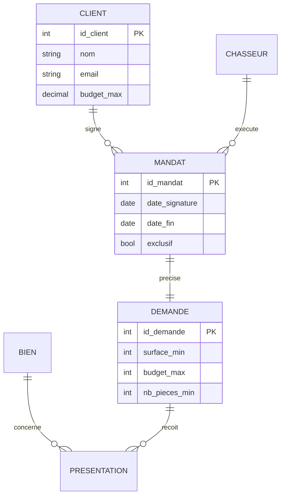

# 🗂️ MCD / Merise — modéliser les données pas à pas

> **Fiche de cours + modèle.** La modélisation Merise est la méthode française de référence pour concevoir une base de données. C'est le **cœur du projet** (bloc **BC05**) : avant d'écrire la moindre table SQL, on dessine le modèle. Rattaché à la Phase 2 — voir [`TRACABILITE-COMPETENCES.md`](./TRACABILITE-COMPETENCES.md).

## L'idée en une phrase

Modéliser, c'est **décrire le métier en entités et en liens** avant de penser « tables ». On passe du réel (« un chasseur signe des mandats pour des clients ») à un schéma précis, puis à du SQL. Merise organise ce passage en **trois niveaux**.

## Les 3 niveaux de Merise

| Niveau | Répond à | Contient |
| --- | --- | --- |
| **MCD** — Modèle Conceptuel de Données | *Quoi ?* (le métier, indépendant de la technique) | Entités, associations, cardinalités |
| **MLD** — Modèle Logique de Données | *Comment l'organiser ?* (encore indépendant du SGBD) | Tables, clés primaires, clés étrangères |
| **MPD** — Modèle Physique de Données | *Avec quelle techno ?* | Le SQL réel (types MySQL/PostgreSQL, index…) |

> 🧠 On descend toujours dans cet ordre : **MCD → MLD → MPD**. Le MCD parle métier (compréhensible par le patron), le MPD parle SQL (exécutable par le SGBD).

---

## Le vocabulaire du MCD

* **Entité** : un objet du métier dont on veut garder des informations (un CLIENT, un BIEN, un MANDAT).
* **Propriété (attribut)** : une information d'une entité (le nom d'un client, le prix d'un bien).
* **Identifiant** : la propriété qui distingue chaque occurrence (l'id). Souligné dans un MCD.
* **Association** : un lien entre entités (un client SIGNE un mandat).
* **Cardinalités** : combien de fois une occurrence participe à l'association. Elles se lisent par paires **(minimum, maximum)**.

### Lire les cardinalités

Pour chaque entité reliée à une association, on se demande : *« une occurrence de cette entité est liée à combien d'occurrences de l'autre, au minimum et au maximum ? »*

| Notation | Signifie |
| --- | --- |
| **(0,1)** | zéro ou une fois |
| **(1,1)** | exactement une fois |
| **(0,n)** | zéro ou plusieurs fois |
| **(1,n)** | une ou plusieurs fois |

> Exemple : « un CLIENT (1,n) SIGNE (1,1) un MANDAT » se lit : un client signe au moins un mandat (sinon ce n'est pas un client), et un mandat appartient à exactement un client.

---

## Exemple de MCD (extrait du projet)

> Les cardinalités Mermaid : `||--o{` = « un et un seul » côté barre, « zéro ou plusieurs » côté patte de corbeau. C'est la traduction visuelle de (1,1) et (0,n).

---

## Du MCD au MLD : les règles de passage

> Ces règles sont mécaniques. Une fois le MCD juste, le MLD s'en déduit presque automatiquement.

1. **Chaque entité devient une table.** Son identifiant devient la clé primaire (PK).
2. **Association « un à plusieurs » (1,n)** : la clé primaire du côté « un » descend comme **clé étrangère (FK)** du côté « plusieurs ».
   * *Ex. : un client signe plusieurs mandats → `mandats.client_id` référence `clients.id`.*
3. **Association « plusieurs à plusieurs » (n,n)** : on crée une **table d'association** portant les deux clés étrangères.
   * *Ex. : un bien est présenté pour plusieurs demandes et une demande reçoit plusieurs biens → table `presentations(bien_id, demande_id)`.*
4. **Les propriétés de l'association** (s'il y en a) vont dans la table issue de l'association.

---

## Méthode pas à pas

1. **Lister les entités** à partir du métier (relire le parcours utilisateur du projet).
2. **Lister les propriétés** de chaque entité, repérer l'identifiant.
3. **Tracer les associations** entre entités (verbe d'action : signe, exécute, concerne…).
4. **Poser les cardinalités** des deux côtés de chaque association (min, max).
5. **Vérifier** : chaque entité a-t-elle un identifiant ? chaque association a-t-elle un sens métier ?
6. **Dériver le MLD** avec les règles de passage ci-dessus.
7. **Écrire le MPD** (le SQL) en choisissant les types du SGBD.

---

## À remplir — votre MCD

* **Entités identifiées :** _(liste)_
* **Associations et cardinalités :** _(ex. CLIENT (1,n) — (1,1) MANDAT)_
* **Schéma :** _(insérez votre diagramme, Mermaid ou export d'outil)_
* **Choix débattus dans le binôme :** _(ex. comment gérer l'auteur d'un commentaire, client OU chasseur — quelle solution, pourquoi ?)_

---

## Pièges fréquents

* **Confondre entité et propriété** : « ville » est-elle une entité (avec ses propres infos) ou une simple propriété ? Ça dépend du métier.
* **Oublier une cardinalité minimale** : un mandat sans client est-il possible ? Non → (1,1), pas (0,1).
* **Modéliser du (n,n) sans table d'association** : impossible en relationnel, il faut toujours la table pivot.
* **Sauter le MCD pour aller direct au SQL** : on perd la vue métier et on empile les erreurs de structure.

> ⚠️ Le jury peut demander de **justifier chaque cardinalité**. « Pourquoi (1,n) et pas (0,n) ? » doit avoir une réponse métier.