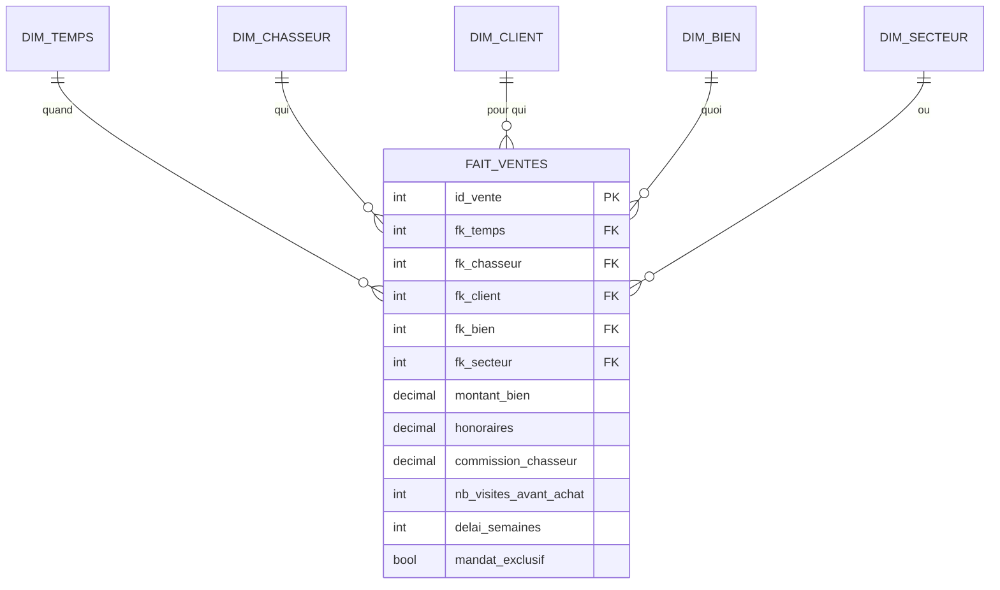
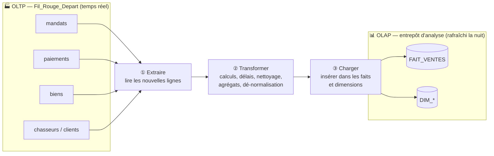

# 📊 OLAP — la base qui sert à analyser et décider

> **Fiche de cours + modèle.** OLAP = *OnLine Analytical Processing*. C'est la base de données du **recul** : celle qui sert à agréger, comparer, mesurer sur de grands volumes et de longues périodes. Elle ne remplace pas l'OLTP — elle vit **à côté**, et se nourrit de lui. Dans ce projet, concevoir un schéma OLAP relève du bloc **BC05** — voir [`TRACABILITE-COMPETENCES.md`](./TRACABILITE-COMPETENCES.md).

## À quoi ça sert, concrètement

« Quel chasseur génère le plus de commissions par trimestre ? », « quel délai moyen entre mandat et achat par secteur ? », « le taux de transformation baisse-t-il quand le budget client augmente ? ». Ces questions **balaient tout l'historique** et **agrègent** des milliers de lignes. Les poser directement sur l'OLTP le ralentirait pour le métier. On les pose donc sur une base **pensée pour la lecture massive** : l'OLAP.

> 🧠 **L'intuition à retenir :** l'OLAP répond à la question *« qu'est-ce que TOUT mon historique me dit, vu sous tel ou tel angle ? »*. Peu d'écritures, d'énormes lectures agrégées.

## OLTP vs OLAP en un coup d'œil

| | **OLTP** (transactionnel) | **OLAP** (analytique) |
| --- | --- | --- |
| Question | « que se passe-t-il maintenant ? » | « que dit mon historique ? » |
| Opérations | beaucoup d'écritures courtes | peu d'écritures, lectures massives |
| Modélisation | normalisée (3NF), anti-redondance | dénormalisée (étoile/flocon), lecture rapide |
| Fraîcheur | temps réel | rafraîchie périodiquement (ex. chaque nuit) |
| Optimisé pour | intégrité + rapidité d'écriture | rapidité d'agrégation en lecture |
| Exemple ici | `Fil_Rouge_Depart` | entrepôt d'analyse des ventes/commissions |

---

## Comment on modélise en OLAP : le schéma en étoile

On **dénormalise volontairement** (l'inverse de l'OLTP) : une table de **faits** centrale contenant les **mesures** (les nombres qu'on veut analyser), entourée de tables de **dimensions** (les axes selon lesquels on analyse). On assume la redondance parce qu'on privilégie la **vitesse de lecture**.



* **Étoile (star)** : dimensions dénormalisées (plates). Simple, très rapide. Le choix par défaut.
* **Flocon (snowflake)** : dimensions re-normalisées en sous-tables. Moins de redondance, plus de jointures. À réserver aux dimensions complexes.

> On lit ce schéma ainsi : *une mesure (ex. commission_chasseur) PAR une ou plusieurs dimensions (ex. par chasseur, par trimestre)*. Le mot « PAR » = un GROUP BY sur une dimension.

---

## Comment l'OLTP alimente l'OLAP

L'OLAP ne se remplit pas tout seul : on **copie et transforme** périodiquement les données de l'OLTP vers l'OLAP. La logique se résume en trois temps — **Extraire, Transformer, Charger** :



> ⚠️ **Aucun outil n'est imposé.** Extraire-transformer-charger est une **logique**, pas un logiciel : un simple script SQL (`INSERT ... SELECT` avec jointures et calculs), ou du code, suffit à l'échelle de ce projet. Inutile de déployer un outil dédié.

### Exemple concret d'alimentation

Peupler `FAIT_VENTES` à partir de l'OLTP revient à écrire une requête de ce genre (à adapter) :

```sql
INSERT INTO olap.fait_ventes (fk_temps, fk_chasseur, montant_bien, commission_chasseur, delai_semaines)
SELECT
    t.id,
    p.chasseur_id,
    p.montant_bien,
    p.commission_chasseur,
    FLOOR(DATEDIFF(p.date_achat, m.date_signature) / 7)  -- délai en semaines
FROM oltp.paiements p
JOIN oltp.mandats  m ON m.id = p.mandat_id
JOIN olap.dim_temps t ON t.date = p.date_achat;
```

---

## Comment travailler avec les deux au quotidien

* **L'application métier écrit dans l'OLTP** (signatures, paiements, commentaires) — temps réel, intégrité garantie.
* **Un rafraîchissement périodique** (ex. chaque nuit) recopie/transforme les nouvelles données vers l'OLAP.
* **Les tableaux de bord, rapports et modèles d'IA lisent dans l'OLAP** — sans jamais peser sur la base métier.
* **Règle de séparation :** on ne fait pas d'analyse lourde sur l'OLTP, et on ne fait pas de saisie métier dans l'OLAP. Chacun son rôle.

> 🔗 Cette séparation est aussi ce qui rend l'**IA** possible sans risque : le modèle de matching ou de scoring lit un OLAP propre et dénormalisé, pas la base de production. Voir la fiche [`OLTP.md`](./OLTP.md) pour l'autre moitié du tableau.

---

## Exemple de matrice — Cadrage d'un besoin OLAP

> Modèle à remplir avant de concevoir le schéma : il force à définir le **grain** et les **axes** avant de dessiner les tables.

| Élément | À définir | Exemple |
| --- | --- | --- |
| **Question métier** | ce qu'on veut mesurer | performance des chasseurs |
| **Grain du fait** | ce que représente 1 ligne | une vente (acte signé) |
| **Mesures** | les nombres analysés | montant, honoraires, commission, nb visites, délai |
| **Dimensions** | les axes d'analyse | temps, chasseur, client, bien, secteur |
| **Source(s) OLTP** | d'où viennent les données | mandats, paiements, biens |
| **Fréquence de rafraîchissement** | à arbitrer (éco-conception) | quotidienne (nuit) |

---

## Décision / conclusion *(à remplir)*

_(2 à 4 phrases : quel grain, quelles dimensions, étoile ou flocon, quelle fréquence de rafraîchissement — et pourquoi. À défendre à l'oral.)_