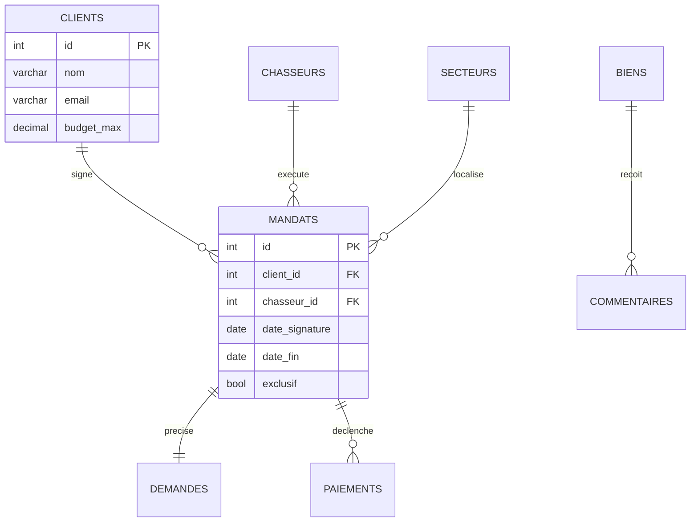

# 🏭 OLTP — la base qui fait tourner le métier

> **Fiche de cours + modèle.** OLTP = *OnLine Transaction Processing*. C'est la base de données du **quotidien** : celle qui enregistre chaque action métier au moment où elle se produit. Dans ce projet, la base `Fil_Rouge_Depart` (et le modèle cible que vous allez concevoir) **est** une base OLTP.

## À quoi ça sert, concrètement

Quand un chasseur signe un mandat, quand un client ajoute un commentaire sur un bien, quand un paiement est enregistré : **chaque événement est une transaction** écrite immédiatement dans la base OLTP. L'objectif est de faire fonctionner l'entreprise en temps réel, de façon fiable, sans jamais perdre ni corrompre une donnée.

> 🧠 **L'intuition à retenir :** l'OLTP répond à la question *« que se passe-t-il MAINTENANT, et comment l'enregistrer correctement ? »*. Beaucoup de petites écritures, très ciblées.

## Les caractéristiques clés

* **Beaucoup d'écritures courtes** : INSERT, UPDATE, DELETE sur quelques lignes à la fois.
* **Temps réel** : la donnée doit être juste à la seconde près.
* **Transactions ACID** : une opération réussit entièrement ou pas du tout (ex. « créer la commande ET décrémenter le stock »).
* **Modèle normalisé (3NF)** : on évite la redondance pour garantir l'intégrité. Chaque information est stockée à un seul endroit.
* **Requêtes simples et rapides** : « donne-moi le mandat n°42 », pas « calcule la moyenne des commissions sur 3 ans ».

## Comment on modélise en OLTP : la normalisation

La règle d'or est d'**éviter de répéter une information**. Si la ville d'un secteur change, on ne veut pas la corriger dans 5000 lignes de mandats : on la stocke **une fois** dans une table `secteurs`, et les mandats y font référence par une clé étrangère.

> Ici chaque entité a sa table, reliée aux autres par des clés étrangères. C'est **normalisé** : pas de doublon, intégrité garantie par les contraintes. Parfait pour écrire vite et juste — mais lourd à interroger quand on veut agréger sur tout l'historique (beaucoup de jointures).

---

## Exemple de matrice — Inventaire des transactions OLTP

> Modèle à remplir : recensez les principales **opérations d'écriture** que votre base OLTP doit supporter. Ça aide à valider que le modèle de données couvre bien tous les actes métier.

| Transaction métier | Opération | Tables touchées | Contraintes / règles | Fréquence estimée |
| --- | --- | --- | --- | --- |
| Signer un mandat | INSERT | mandats, demandes | date_fin = signature + 6 mois ; client_id doit être un client | quelques /jour |
| Enregistrer un commentaire | INSERT | commentaires | auteur = client OU chasseur | dizaines /jour |
| Enregistrer un paiement | INSERT | paiements | commission selon barème en vigueur | quelques /semaine |
| Mettre à jour le statut d'un mandat | UPDATE | mandats | transitions autorisées uniquement | quotidien |
| _…_ | | | | |

---

## Le point de bascule vers l'OLAP

L'OLTP est excellent pour **faire tourner** le métier, mais dès qu'on veut **analyser** (« quel chasseur performe le mieux par secteur et par trimestre ? »), les requêtes deviennent lourdes : énormément de jointures, agrégations sur tout l'historique, ce qui **ralentit la base pendant que le métier tourne**.

> 👉 C'est là qu'intervient l'**OLAP** : une seconde base, dédiée à l'analyse, alimentée depuis l'OLTP. Voir la fiche [`OLAP.md`](./OLAP.md), section « Comment l'OLTP alimente l'OLAP ».

Dans le projet, cette distinction relève du bloc **BC05** — voir [`TRACABILITE-COMPETENCES.md`](./TRACABILITE-COMPETENCES.md).