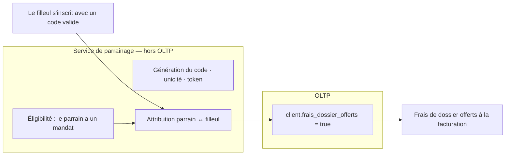

# ADR — Mécanique de parrainage (filleul seul, code géré hors OLTP)

> **Numéro :** proposé ADR-034 · **Statut :** Accepté
> **Date :** 2026-10-02 · **Origine :** ajout de l'équipe, **validé PO** (hors user stories).
> **Remplace :** le lien `client.id_client_parrain` + `date_parrainage` (supprimés). Renvoi grille : E7.

## 1. Contexte

La v7 ne portait qu'un **lien** de parrainage (`client.id_client_parrain`), sans récompense. Après simplifications successives, le dispositif retenu est : **avantage réservé au filleul**, et **gestion du code déléguée à un service externe**. L'empreinte OLTP se réduit alors à **un seul drapeau booléen**.

## 2. Décision

- **Code de parrainage géré hors OLTP** : un **service dédié** assure la **génération du code**, son **unicité**, le **token**, l'**attribution** parrain ↔ filleul et l'**éligibilité** du parrain (avoir signé un mandat). Rien de tout cela n'entre dans la base métier.
- **Empreinte OLTP = un booléen** : `client.frais_dossier_offerts`. À `true`, les **frais de dossier** du client (filleul) sont **offerts** (valeur = le forfait en vigueur).
- **Avantage filleul seul** : aucune récompense au parrain.
- **Non-cumul natif** : un booléen → l'avantage est accordé une fois.
- **Suppression** des colonnes devenues inutiles : `client.id_client_parrain`, `client.date_parrainage` et la contrainte `ck_client_parrainage` (l'attribution vit désormais dans le service externe).

## 3. Règles métier

| Règle | Détail |
|---|---|
| Éligibilité à parrainer | Avoir **signé au moins un mandat** — **vérifiée par le service externe**. |
| Bénéficiaire | **Le filleul uniquement.** |
| Avantage | **Frais de dossier offerts** (valeur = forfait en vigueur). |
| Attribution / unicité du code | **Hors OLTP** (service externe, token). |
| Marque en base | `client.frais_dossier_offerts = true` lorsqu'un code valide a été utilisé. |
| Non-cumul | Booléen → accordé une seule fois. |

## 4. Schéma conceptuel

## 5. Modèle de données (OLTP) — minimal

- **Ajout :** `client.frais_dossier_offerts boolean NOT NULL DEFAULT false`.
- **Suppression :** `client.id_client_parrain`, `client.date_parrainage`, contrainte `ck_client_parrainage` (attribution externalisée).
- **Valeur monétaire :** le forfait frais de dossier reste un **paramètre** (`parametre_frais`, versionné) ; inutile de le figer pour un simple drapeau — le montant offert se lit au moment de la facturation. *(Si la comptabilité exige de figer le montant exact offert, ajouter une colonne numérique ; non retenu ici par principe de minimalité.)*

## 6. Frontière OLTP / service externe

| Responsabilité | Où |
|---|---|
| Génération / unicité / token du code | **Service externe** |
| Attribution parrain ↔ filleul, reporting du parrainage | **Service externe** |
| Vérification de l'éligibilité (parrain a un mandat) | **Service externe** |
| Fait « ce client bénéficie des frais de dossier offerts » | **OLTP** (le booléen) |

## 7. Alternatives écartées

| Option | Rejet |
|---|---|
| Stocker code + `id_parrain` + cycle d'avantage en OLTP | Sur-dimensionné : la gestion du code est un service à part ; l'OLTP n'a besoin que du **résultat** (booléen). |
| Récompenser aussi le **parrain** (deux récompenses) | Réintroduit risque Hoguet, exposition non bornée, breakage, RGPD — conservé en **ouverture** (§9). |
| Conserver `id_client_parrain` comme trace en base | Possible, mais l'attribution est désormais externe → colonne sans usage métier (supprimée par minimalité ; réversible). |

## 8. Risques, limites et conséquences

- **Juridique (Hoguet)** 🟢 — une **remise à son propre client** n'est pas de l'intermédiation ; aucun non-professionnel n'est rémunéré. *(À faire confirmer par un juriste — ce n'est pas un avis juridique.)*
- **Exposition** 🟢 bornée — un avantage `F` par filleul converti, proportionnel à l'activité.
- **Breakage / RGPD** 🟢 — pas de bon/crédit (aucune dette), aucune notification au parrain depuis l'OLTP.
- **Effet d'aubaine** 🟡 résiduel — on offre `F` à des filleuls parfois venus de toute façon (coût faible, borné).
- **Limites :** incitation **plus douce** (le parrain n'a pas de gain financier) ; **l'attribution n'est plus en base** → tout reporting parrain/filleul passe par le service externe ; `F` est un coût certain (faible) par filleul converti.

## 9. Ouverture — variante « deux récompenses »

Évolution possible : récompense parrain de valeur `F` (remise si actif, bon/crédit sinon), déclenchée à l'achat du filleul. **Conditions impératives** : plafond par parrain, expiration des bons, consentement RGPD, **validation juridique (Hoguet)**. Sans ces garde-fous, ne pas l'activer. *(Cette variante réintroduirait de l'attribution et des montants en base.)*

## 10. Rattachement RNCP40573

BC01 — besoin hors US formalisé, risques et alternatives tracés · BC03 — règle portée par un drapeau simple, frontière OLTP/service claire · BC05 — empreinte minimale, ouverture documentée.
