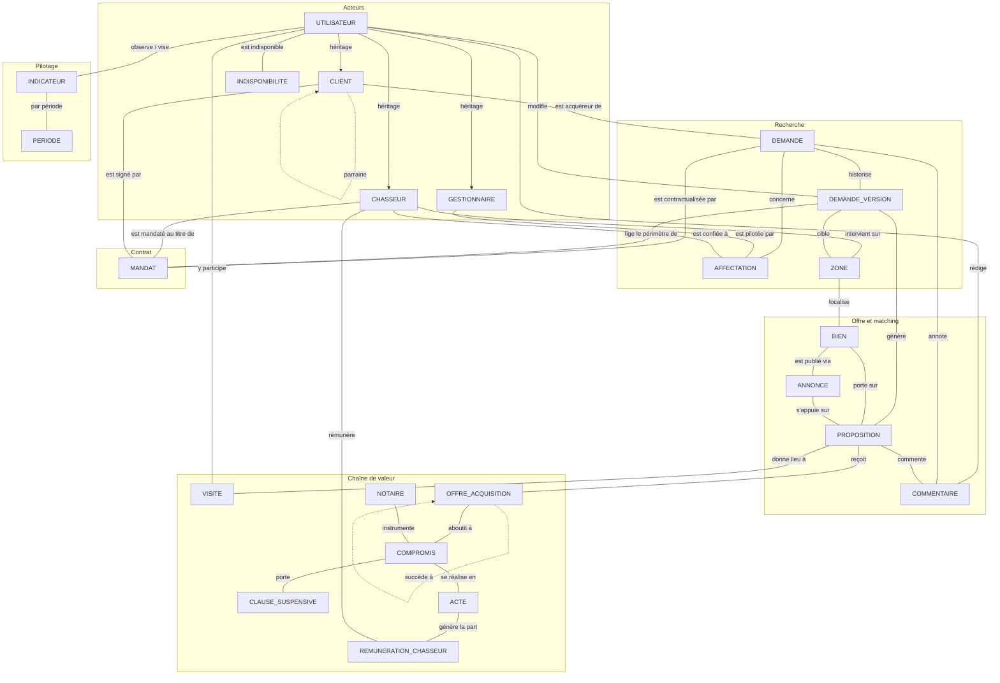
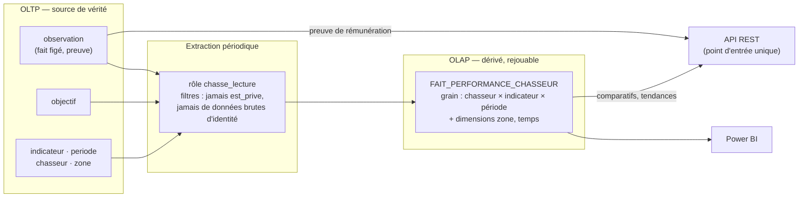

# Dossier de modélisation — v7

**Plateforme de chasse immobilière** · Titre visé : Expert en informatique et SI — RNCP40573 (BC01 · BC02 · BC03 · BC05)
**Date de référence projet :** 25 juillet 2026

> ⚠️ Entreprise, données et personnages fictifs. Document destiné au Dossier Professionnel, à la soutenance et au partage Confluence.

---

## 0. Objet et périmètre de la v7

La v7 est une **version consolidée qui tient seule** : contrairement aux v5 et v6, qui appliquaient un principe de non-duplication (chaque version ne décrivait que ses écarts), ce document reprend l'intégralité du modèle — dictionnaire, MCD, MLD, MPD, méthode et décisions — sans exiger la lecture des versions antérieures.

### Ce que la v7 change par rapport à la v6

| # | Changement | Origine |
|---|---|---|
| 1 | **Ouverture OLAP** : introduction d'un fait analytique dérivé `FAIT_PERFORMANCE_CHASSEUR`, alimenté depuis `observation`, pour les comparatifs multi-chasseurs/zones/périodes (§7). L'OLTP reste la source de vérité | ADR-025 |
| 2 | **RG-01 sur les commentaires** : un client ne peut jamais poser `est_prive = vrai` ; seul un chasseur (ou gestionnaire) le peut. Contrôle applicatif (déclencheur) + RLS via `app.user_id` | ADR-027 |
| 3 | **Confirmation renforcée de la séparation des rôles** (tables `client`/`chasseur`/`gestionnaire` séparées) : un arbitrage inverse envisagé en cours de projet a été écarté après confrontation au dictionnaire complet | ADR-026 |
| 4 | **Clés primaires en UUID** : abandon du `bigint IDENTITY` prototypé, pour absorber la fusion multi-SI des rachats (Phase 3) sans collision de clés | ADR-028 |
| 5 | **Rémunération chasseur** : nouvelle table `remuneration_chasseur` qui gèle la part au moment de la vente (la règle de calcul reste à définir avec le PO) | ADR-029 |
| 6 | **Mandat refondu** : `date_debut` seule stockée, `date_fin`/durée calculées en vue, renouvellement = nouveau mandat avec filiation. L'anomalie A01 de l'audit devient structurellement impossible | ADR-030 |
| 7 | **Critères d'équipement en booléens** (choix confirmé, domaine fermé) : table `CARACTERISTIQUE` générique écartée, reportée à une éventuelle intégration IA | ADR-031 |
| 8 | **Dictionnaire enrichi** d'une colonne « Contraintes » (PK, FK, UNIQUE, NOT NULL, CHECK, valeur par défaut) sur chaque attribut | Demande d'équipe |
| 9 | **Validation par exécution** : structure complète montée et testée sur PostgreSQL 16.15 (20 rejets + 5 scénarios valides) | ADR-013 |
| 10 | Consolidation : les 23 entités, 34 associations actives, 18 contraintes et l'ensemble des ADR connus sont repris dans un document unique | — |

### Limites explicites

- Les ADR-001 à 012, 014, 020 et 021 des versions antérieures n'ont pas été retrouvés dans les documents transmis : la v7 reprend uniquement les ADR dont le contenu est connu (013, 015 à 019, 022 à 024) et ajoute les nouveaux (025 à 031). Les numéros manquants sont réservés et **ne doivent pas être réattribués**.
- Le dictionnaire des 6 entités de la chaîne de valeur (VISITE, OFFRE_ACQUISITION, COMPROMIS, CLAUSE_SUSPENSIVE, ACTE, NOTAIRE) est repris de `modelisation-v6.md`, moins détaillé à l'origine que celui des 16 entités v5 ; les compléments déduits sont signalés *(déduit)*.
- Les arbitrages structurants sont tranchés (ADR-026 à 031, dont UUID et refonte du mandat) ; les points restants tracés au §9 (règle exacte de calcul de la part chasseur, fréquence OLAP) ne touchent pas la structure.

---

## Sommaire

1. [Méthode Merise de bout en bout](#1-méthode-merise-de-bout-en-bout)
2. [Dictionnaire des données](#2-dictionnaire-des-données) — 23 entités + 5 jonctions, avec contraintes
3. [MCD](#3-mcd--modèle-conceptuel-de-données) — 34 associations actives, 18 contraintes
4. [MLD](#4-mld--modèle-logique-de-données) — règles R1–R7, 28 relations
5. [Dénormalisations et normalisation](#5-dénormalisations-assumées-et-normalisation)
6. [MPD PostgreSQL](#6-mpd--modèle-physique-de-données-postgresql-1615)
7. [Ouverture OLAP](#7-ouverture-olap-nouveau-v7)
8. [Décisions d'architecture (ADR)](#8-décisions-darchitecture-adr)
9. [Points ouverts](#9-points-ouverts)
10. [Rattachement RNCP40573](#10-rattachement-rncp40573)


---

## 1. Méthode Merise de bout en bout

La démarche suivie est le fil Merise classique, chaque niveau ayant un rôle exclusif. Descendre d'un niveau sans avoir stabilisé le précédent produit des modèles qui mélangent les préoccupations — le défaut central du SI hérité audité en Phase 1.

```
Existant (fixtures + audit)
        │  ce qui est
        ▼
Dictionnaire des données          ← QUOI : chaque donnée, sa nature, sa justification métier
        │
        ▼
MCD (conceptuel)                  ← SENS : entités, associations, cardinalités, contraintes
        │  indépendant de toute technologie
        ▼
MLD (logique)                     ← STRUCTURE : relations, clés primaires/étrangères, normalisation
        │  relationnel, mais indépendant du SGBD
        ▼
MPD (physique)                    ← IMPLÉMENTATION : PostgreSQL, types, index, déclencheurs, vues, droits
        │
        ▼
BDD OLTP → migration → API → OLAP → BI → IA   (phases suivantes du projet)
```

### 1.1 Rôle de chaque niveau

| Niveau | Contient | Ne contient jamais |
|---|---|---|
| **Dictionnaire** | Nom, type pressenti, justification métier, contraintes de validité de chaque attribut | Clés étrangères, tables de jonction, index |
| **MCD** | Entités, associations (avec cardinalités min/max sur chaque patte), identifiants, contraintes inter-associations (partition, inclusion…) | Types SQL, NOT NULL, attributs techniques (`password_hash`), attributs calculés dérivables |
| **MLD** | Relations, clés primaires et étrangères, règles de transformation, dénormalisations assumées, preuve de normalisation (1FN/2FN/3FN) | Types PostgreSQL, index physiques, déclencheurs |
| **MPD** | DDL PostgreSQL : types, domaines, contraintes CHECK, index, vues, déclencheurs, rôles et droits | Rien de conceptuel qui ne soit tracé plus haut |

### 1.2 Doctrine KPI — comment un indicateur entre dans un modèle

Reprise de la v5, c'est le point méthodologique le plus délicat du dossier :

> Un KPI n'est **jamais** une entité ni un attribut d'entité. Ce qui se modélise, ce sont les **faits datés** qui le rendent calculable.

Trois voies :

1. **Horodatage** — un délai se calcule à partir de deux dates ; si l'une manque, le KPI est structurellement impossible (ex. `demande.date_affectation`).
2. **Historisation** — quand un KPI porte sur une charge ou une évolution, la relation est **réifiée en entité datée** (ex. `AFFECTATION` : sans elle, une réaffectation efface le travail du premier gestionnaire).
3. **Gel** — une mesure calculée puis figée est un fait métier daté, non recalculable à l'identique. Elle se modélise en association ternaire (`OBSERVE` → `observation`), jamais en colonnes `kpi_1`, `kpi_2` sur l'acteur.

**Test de recevabilité** : recalculable à tout instant ? Ne pas modéliser. Le résultat changerait-il dans six mois ? Fait à figer. Le calcul exige un état passé ? Il manque une historisation.

**Prolongement v7 (ADR-025)** : le *gel* (voie 3) reste transactionnel — c'est une preuve, notamment de rémunération. Le besoin *comparatif* (se situer vs ses pairs, tendances multi-périodes) est un usage distinct, servi par un fait OLAP **dérivé** du gel, jamais l'inverse (§7).

---
# 2. Dictionnaire des données

**Convention.** La colonne « Type » indique le type pressenti (artefact Merise antérieur au MCD, à titre de cadrage). La colonne « Contraintes » — ajout v7 — anticipe les règles de validité qui seront portées par les niveaux logique et physique : `PK` (clé primaire), `FK→table` (clé étrangère), `U` (unique), `NN` (not null), `D:` (valeur par défaut), `CK:` (contrôle de valeur), `GEN:` (colonne générée). Un attribut sans `NN` est nullable, et la justification du NULL est donnée quand elle porte un sens métier.

Identifiants préfixés `#`. **R** = identification relative.

## 2.1 UTILISATEUR

Personne physique disposant d'un accès. Sur-type des trois rôles. Héritage **non exclusif et non total** : un utilisateur peut cumuler les rôles ou n'en avoir aucun.

| Attribut | Type | Contraintes | Justification |
|---|---|---|---|
| `# id_utilisateur` | entier | PK | Identifiant technique, stable même en cas de changement d'email |
| `nom` / `prenom` | varchar(80) | NN | Identité civile, obligatoire sur les actes signés |
| `email` | varchar(255) | U, NN, CK: format | Identifiant de connexion. Insensible à la casse (citext au MPD) |
| `telephone` | varchar(20) | CK: format | Canal privilégié en qualification. NULL accepté : tous les canaux d'entrée ne le collectent pas |
| `password_hash` | texte | NN | Empreinte bcrypt/argon2. Attribut technique, absent du MCD |
| `date_creation` | timestamp | NN, D: now() | Ancienneté du compte, base des purges RGPD |
| `actif` | booléen | NN, D: vrai | Suspension sans suppression : mandats et commentaires historiques restent rattachés |
| `date_anonymisation` | timestamp | CK: NULL ou NOT actif | Horodate la procédure d'anonymisation RGPD ; sans elle, on ne prouve ni qu'elle a eu lieu, ni quand. Un compte anonymisé est nécessairement inactif (C12) |

## 2.2 CLIENT

Spécialisation de `UTILISATEUR`. **Particulier acquéreur** (le B2B est hors périmètre — ADR-018), agissant pour son compte ou celui de son foyer.

| Attribut | Type | Contraintes | Justification |
|---|---|---|---|
| `# id_utilisateur` | entier | PK, FK→utilisateur | Clé primaire = clé étrangère vers le sur-type (héritage R7) |
| `id_client_parrain` | entier | FK→client | Association réflexive PARRAINE. NULL : la plupart des clients ne sont pas parrainés |
| `date_parrainage` | date | CK: NN si parrain | Rend la viralité et la récompense de parrain calculables |
| `annee_naissance` | smallint | CK: plage plausible | Durée d'emprunt mobilisable, segmentation. **Année seule** plutôt que date : même usage métier, exposition RGPD moindre (minimisation) |
| `primo_accedant` | booléen | NN, D: faux | Segment au comportement distinct (PTZ, décision plus longue). Discriminant de premier plan des taux de transformation |
| `code_postal_residence` | varchar(10) | CK: format FR | Distinct de la zone recherchée. Détecte les mobilités entrantes, au cycle plus long |
| `canal_contact_prefere` | varchar(20) | CK: liste | Téléphone, email, SMS. Conditionne le taux de réponse aux propositions |
| `consentement_marketing` | booléen | NN, D: faux | Distinct du consentement au traitement du lead (porté par DEMANDE). La prospection exige son propre consentement |
| `date_consentement_marketing` | timestamp | CK: NN si consentement | Un consentement non horodaté n'est pas démontrable |
| `niveau_vigilance` | varchar(20) | NN, D: standard, CK: liste | Standard ou renforcée. Obligation LCB-FT, applicable aux personnes physiques |
| `date_derniere_verification` | date | — | Une vérification d'identité a une durée de validité ; sans date, la conformité n'est pas démontrable |
| `origine_fonds_declaree` | texte | — | Déclaration LCB-FT, exigible sur les montages atypiques (donation, vente à l'étranger) |

> **Deux attributs volontairement écartés** (minimisation RGPD) : les **revenus bruts** (une tranche suffit à tout usage métier) et la **situation familiale** (le besoin réel — combien de personnes vivront dans le logement — est un critère de recherche : `demande_version.nb_occupants`).

## 2.3 CHASSEUR

Spécialisation de `UTILISATEUR`. Seul acteur soumis à une obligation légale directe : la loi Hoguet encadre l'exercice, et un mandat signé hors conditions est nul.

**Volet conformité**

| Attribut | Type | Contraintes | Justification |
|---|---|---|---|
| `# id_utilisateur` | entier | PK, FK→utilisateur | Héritage R7 |
| `numero_carte_t` | varchar(30) | NN, U | Carte professionnelle transaction. Mention obligatoire sur le mandat |
| `date_validite_carte_t` | date | NN | Carte délivrée pour trois ans. Un mandat signé carte expirée est nul : sans cette date, aucun contrôle possible |
| `prefecture_delivrance` | varchar(60) | NN | Mention obligatoire sur le mandat et au registre |
| `organisme_garant` | varchar(80) | NN | Garantie financière : mention légale obligatoire du mandat |
| `montant_garantie_financiere` | numeric(12,2) | NN, CK: > 0 | Idem |
| `numero_rcp` | varchar(40) | NN | Responsabilité civile professionnelle, obligatoire |
| `date_echeance_rcp` | date | NN | Renouvellement annuel : sans échéance, pas de contrôle de conformité |
| `statut_juridique` | varchar(30) | NN, CK: liste | Salarié, agent commercial, indépendant. Conditionne rémunération et régime fiscal |
| `numero_rsac` | varchar(30) | CK: NN si agent commercial | Registre spécial des agents commerciaux, obligatoire pour les mandataires uniquement |

**Volet exploitation**

| Attribut | Type | Contraintes | Justification |
|---|---|---|---|
| `date_entree_reseau` | date | NN | Ancienneté. Neutralise le biais d'un arrivant récent dans tout classement |
| `date_sortie_reseau` | date | CK: ≥ entrée | Sortie sans suppression |
| `capacite_max_mandats` | smallint | NN, CK: > 0 | Plafond de mandats actifs simultanés : un chasseur saturé rend un service dégradé |
| `budget_min_intervention` / `budget_max_intervention` | numeric(12,2) | CK: min ≤ max | Segment d'expertise : un chasseur haut de gamme n'est pas interchangeable |
| `taux_honoraires_defaut` | numeric(5,2) | CK: 0–100 | Valeur proposée, **recopiée et figée au mandat** — deux données distinctes |

> Les **zones d'intervention** et **spécialités** sont des associations n-n (`chasseur_zone`), pas des colonnes : un chasseur *est* territorial, sa valeur ajoutée est la connaissance d'un marché local. L'affectation devient alors calculable : zone ∩ budget ∩ typologie ∩ charge disponible.

## 2.4 GESTIONNAIRE

Spécialisation de `UTILISATEUR`. Cinq colonnes suffisent : l'essentiel de ce qui rend ses KPI calculables se stocke sur `DEMANDE` et `AFFECTATION`.

| Attribut | Type | Contraintes | Justification |
|---|---|---|---|
| `# id_utilisateur` | entier | PK, FK→utilisateur | Héritage R7 |
| `matricule` | varchar(20) | U, NN | Rapprochement SIRH et paie variable. Distinct de l'identifiant technique |
| `date_entree_fonction` | date | NN | Ancienneté dans le rôle : comparer un arrivant de mars à un ancien fausse tout classement |
| `date_sortie_fonction` | date | CK: ≥ entrée | Sortie du rôle sans suppression du compte. Un booléen `actif` ne dit pas *quand* |
| `equipe` | varchar(40) | — | Maille d'agrégation des KPI. En lot 2 : entité EQUIPE avec responsable |
| `capacite_max_leads` | smallint | NN, CK: > 0 | Plafond de leads simultanés. Alimente l'affectation et la détection de surcharge |

## 2.5 INDISPONIBILITE

Entité à identification relative sur `UTILISATEUR`. Congés, arrêts, formations.

| Attribut | Type | Contraintes | Justification |
|---|---|---|---|
| `# id_utilisateur` | entier | PK (composée), FK→utilisateur | Identification relative : n'existe que rattachée à un utilisateur |
| `# date_debut` **R** | date | PK (composée) | Identifiant relatif |
| `date_fin` | date | CK: ≥ début | Absence en cours si nulle |
| `motif` | varchar(60) | NN, CK: liste | Congé, arrêt, formation : le retrait de charge n'est pas traité pareil |

> Sans cette entité, un acteur en congé apparaît lent ou improductif : tout KPI de délai est biaisé. Un booléen `disponible` ne convient pas — ni daté, ni historisable.

## 2.6 ZONE

Référentiel géographique **restructuré en v6 (ADR-022)** : table unique portant tous les niveaux, hiérarchie par colonnes (l'auto-association ENGLOBE a disparu). Alimenté par import officiel (COG INSEE).

| Attribut | Type | Contraintes | Justification |
|---|---|---|---|
| `# id_zone` | entier | PK | Identifiant du référentiel |
| `type_zone` | varchar(20) | NN, CK: ville \| secteur | Granularité de ciblage de la ligne |
| `pays` | varchar(80) | NN | Niveau supérieur, requis par l'ouverture internationale (Phase 3) |
| `code_iso_pays` | char(2) | NN, CK: format ISO | Clé de rapprochement stable, insensible aux variantes de libellé |
| `devise` | char(3) | NN, CK: format ISO | Un budget de 400 000 ne veut rien dire hors devise. Rattachée au pays, elle suit le bien et le mandat |
| `ville` | varchar(120) | NN | Commune |
| `code_insee` | char(5) | CK: NN si France | Obligatoire pour les villes françaises, nul ailleurs |
| `secteur` | varchar(120) | CK: cohérent avec type_zone (C10) | Quartier. Nul sur les lignes de type `ville` |
| `code_postal` | varchar(10) | CK: format FR si France | Contrôle de format — action corrective A07, absente du SI hérité |

Contrainte structurante : `UNIQUE NULLS NOT DISTINCT (pays, ville, secteur)` (C11). **Conséquence à assumer** : l'égalité `(pays, ville)` remplace une clé étrangère hiérarchique — la normalisation des libellés à l'import devient critique (« Montpellier » ≠ « montpellier »). L'unicité bloque le doublon exact, pas le doublon orthographique. Voir aussi la dénormalisation assumée n°6 (§5.1).

## 2.7 DEMANDE

La recherche, du lead brut à sa clôture. Porte les horodatages du cycle de vie sans lesquels aucun KPI de délai n'existe (doctrine §1.2, voie 1).

| Attribut | Type | Contraintes | Justification |
|---|---|---|---|
| `# id_demande` | entier | PK | Identifiant de la recherche |
| `id_gestionnaire` | entier | FK→gestionnaire *(dénorm.)* | Liste de travail permanente ; maintenue par déclencheur depuis `affectation` (§5.1) |
| `id_chasseur` | entier | FK→chasseur *(dénorm.)* | Idem |
| `date_depot` | timestamp | NN | Origine de tous les délais du parcours |
| `canal` | varchar(30) | NN, CK: liste | Site web, parrainage, téléphone. Le taux de transformation varie fortement selon l'origine |
| `description_initiale` | texte | — | Verbatim du client, non structuré. Matière première de la qualification |
| `statut` | varchar(30) | NN, CK: liste | État métier suivi par le gestionnaire. Partiellement dérivable, mais porte `sans_suite` et `close` qu'aucune association n'exprime |
| `date_consentement` | timestamp | CK: NN si canal web (C14/T14) | Consentement RGPD au traitement du lead. Propre à la demande : un même particulier peut en déposer plusieurs |
| `date_affectation` | timestamp | — | **Le KPI n°1 du gestionnaire** : sans cette date, le délai de prise en charge est incalculable |
| `date_qualification` | timestamp | — | Sépare le temps gestionnaire du temps chasseur |
| `date_cloture` | timestamp | — | Durée de cycle complète, dénominateur de tous les taux |
| `motif_sans_suite` | varchar(40) | CK: NN si statut sans_suite | Budget irréaliste, injoignable, hors zone… Les leads perdus sont plus instructifs que les gagnés |
| `nb_relances` | smallint | NN, D: 0 | Effort investi avant abandon : distingue le lead mort du lead sous-travaillé |
| `statut_financement` | varchar(30) | CK: liste | Variable de contrôle sans laquelle le taux de transformation est illisible |
| `apport_disponible` | numeric(12,2) | CK: ≥ 0 | Détermine le budget réel, souvent éloigné du budget déclaré |
| `montant_pret_envisage` | numeric(12,2) | CK: ≥ 0 | Complète l'apport pour la faisabilité |
| `date_accord_principe` | date | — | Point de bascule du lead qualifiable |
| `date_validite_accord` | date | CK: ≥ accord | **Un accord de principe expire** : un mandat qui court au-delà travaille sur un budget qui n'existe plus |

> Le financement appartient au **projet**, pas à la personne : le même client peut avoir un accord sur une recherche et rien sur une autre. D'où son rattachement à DEMANDE.

## 2.8 DEMANDE_ACQUEREUR *(table de jonction, association A4)*

| Attribut | Type | Contraintes | Justification |
|---|---|---|---|
| `# id_demande` | entier | PK (composée), FK→demande | — |
| `# id_client` | entier | PK (composée), FK→client | — |
| `qualite` | varchar(20) | NN, CK: principal \| co_acquereur | Exactement un `principal` par demande (C4). Le couple acquéreur est le cas majoritaire — c'est lui qui justifie la n-n |

## 2.9 AFFECTATION

Réification de l'affectation (doctrine §1.2, voie 2). **Cinq KPI gestionnaire sur six en dépendent** : sans elle, une réaffectation efface le travail du premier gestionnaire.

| Attribut | Type | Contraintes | Justification |
|---|---|---|---|
| `# id_affectation` | entier | PK | Clé technique (ADR-015) ; clé naturelle maintenue en alternative |
| `id_demande` | entier | NN, FK→demande, U(id_demande, date_debut) | Rattachement + clé alternative préservant l'identification relative |
| `id_gestionnaire` | entier | NN, FK→gestionnaire | Pilote |
| `id_chasseur` | entier | FK→chasseur | NULL tant que non confiée à un chasseur |
| `date_debut` **R** | timestamp | NN | Identifiant relatif d'origine |
| `date_fin` | timestamp | CK: ≥ début ; au plus une ligne ouverte par demande (C6) | Affectation en cours si nulle. Reconstitue la charge à toute date passée |
| `motif` | varchar(60) | NN, CK: liste | Initiale, surcharge, absence, désaccord client. Le taux de réaffectation est un signal managérial |

## 2.10 DEMANDE_VERSION

Historisation des critères V1 → V2 → V3, sans écrasement (exigence Readme Phase 2).

| Attribut | Type | Contraintes | Justification |
|---|---|---|---|
| `# id_version` | entier | PK | Clé technique (ADR-015) |
| `id_demande` | entier | NN, FK→demande, U(id_demande, no_version), U(id_demande, id_version) | 1re unicité : préserve l'identification relative. 2e : cible des FK composées de mandat et proposition (ADR-016) |
| `id_modifie_par` | entier | NN, FK→utilisateur | Auteur de l'évolution (client ou chasseur) |
| `no_version` **R** | smallint | NN, CK: > 0 | Il n'existe pas de « version 2 » dans l'absolu, seulement la version 2 de la recherche n°417 |
| `date_creation` | timestamp | NN | Base du KPI de dérive du besoin |
| `motif_evolution` | varchar(255) | NN | Raison de l'ajustement : alimente l'analyse des concessions d'acquéreurs |
| `type_bien` | varchar(30) | NN, CK: liste | Typologie recherchée |
| `destination` | varchar(30) | NN, CK: principale \| secondaire \| locatif | **Le plus discriminant** : explique pourquoi deux clients au même budget refusent des biens opposés. `revente` retirée (activité professionnelle, ADR-018) |
| `budget_max` | numeric(12,2) | NN, CK: > 0 | L'écart V1 → version courante mesure la concession budgétaire |
| `surface_min` | smallint | CK: > 0 | Critère éliminatoire |
| `nb_pieces_min` / `nb_chambres_min` | smallint | CK: ≥ 0 | Critères éliminatoires de distribution |
| `nb_occupants` | smallint | CK: > 0 | Le besoin réel derrière le nombre de chambres |
| `dpe_max` | char(1) | CK: A–G | Contraintes locatives croissantes sur les passoires thermiques |
| `rendement_brut_min` | numeric(5,2) | CK: NN seulement si destination = locatif (T15) | Critère de l'investisseur particulier |
| `travaux_acceptes` | booléen | NN, D: faux | Sépare le clé-en-main de l'acheteur à potentiel |
| `exige_ascenseur` … `exige_cave` | booléen ×6 | NN, D: faux | Six critères d'équipement symétriques des `a_*` du bien. Rédhibitoires par construction |
| `commentaire_criteres` | texte | — | Préférences non modélisées, hors matching. Note unique, atomique au sens 1FN |
| `est_courante` | booléen | NN ; une seule vraie par demande *(dénorm.)* | Requêtée à chaque cycle de matching ; bascule automatique par déclencheur (§5.1) |

## 2.11 VERSION_ZONE *(jonction, A10)* et 2.12 CHASSEUR_ZONE *(jonction, A2)*

| Table | Attributs | Contraintes | Justification |
|---|---|---|---|
| `version_zone` | `# id_version`, `# id_zone` | PK composée, FK des deux côtés | Zones ciblées par une version de critères |
| `chasseur_zone` | `# id_utilisateur`, `# id_zone`, `role_intervention` | PK composée, FK, role NN CK: liste | Territorialité du chasseur, avec rôle (principal/secondaire) |
## 2.13 MANDAT

Le contrat (loi Hoguet).

| Attribut | Type | Contraintes | Justification |
|---|---|---|---|
| `# id_mandat` | entier | PK | Identifiant du contrat |
| `id_demande` | entier | NN, FK→demande ; au plus un mandat actif par demande (C7) | Demande contractualisée |
| `id_version_contractuelle` | entier | NN, FK composée (id_demande, id_version)→demande_version | Fige le périmètre d'origine, opposable en litige. Les versions postérieures valent avenant tacite ; le matching s'exécute sur la version courante |
| `id_chasseur` | entier | NN, FK→chasseur | Mandataire désigné explicitement, figé à la signature (l'affectation étant réversible, on ne peut pas le déduire) |
| `id_signataire` | entier | NN, FK composée (id_demande, id_signataire)→demande_acquereur | **Le signataire est un acquéreur de la demande** (C5) — contrainte déclarative depuis ADR-019 |
| `numero_registre` | varchar(30) | U, NN | Numéro d'ordre au registre des mandats. Obligation légale, sans rupture de séquence |
| `date_signature` | date | NN | Date de l'engagement |
| `mode_signature` | varchar(20) | NN, CK: presentiel \| en_ligne | Conditionne le régime de preuve |
| `date_debut` | date | NN, CK: ≥ signature (T7) | **Prise d'effet ≠ signature** : 14 jours de rétractation en démarchage à domicile (clientèle 100 % consommateurs). **Seule donnée temporelle stockée** (ADR-030) |
| `id_mandat_precedent` | entier | FK→mandat | Filiation de renouvellement : le renouvellement crée un **nouveau** mandat (nouveau numéro de registre) relié au précédent. NULL pour un mandat initial |
| `exclusif` | booléen | NN | Exclusif ou simple. Conditionne le taux et les obligations réciproques |
| `statut` | varchar(20) | NN, CK: actif \| renouvele \| resilie \| clos_succes | **`expire` retiré des valeurs saisissables (ADR-023)** : l'expiration se lit par les dates via la vue `v_mandat`, un statut ne peut plus contredire les dates |
| `taux_honoraires` | numeric(5,2) | CK: 0–100 ; taux ou forfait requis (T6) | Figé à la signature : survit à toute évolution du taux du chasseur |
| `base_honoraires` | varchar(4) | NN, CK: HT \| TTC | Un particulier raisonne TTC ; la mention explicite évite le contentieux |
| `taux_tva` | numeric(5,2) | NN, CK: 0–100 | Figé au contrat : taux du jour de signature |
| `forfait_honoraires` | numeric(12,2) | CK: ≥ 0 ; taux ou forfait requis | Rémunération forfaitaire alternative ou complémentaire |
| `qualite_signataire` | varchar(60) | NN, CK: nom_propre \| procuration | Cas réel entre particuliers (conjoint absent, expatriation) |
| `reference_procuration` | varchar(255) | CK: NN si procuration (T8) | Référence du document |
| `date_resiliation` | date | CK: NN si statut resilie | Un statut `resilie` sans date n'est pas opposable |
| `motif_resiliation` | texte | CK: NN si statut resilie | Exigé par la tenue du registre |

## 2.14 BIEN

Le bien physique, distinct de ses publications.

| Attribut | Type | Contraintes | Justification |
|---|---|---|---|
| `# id_bien` | entier | PK | Identifiant du bien réel |
| `id_zone` | entier | NN, FK→zone | Localisation (référentiel) |
| `type_bien` | varchar(30) | NN, CK: liste | Apparié au critère de la version |
| `surface` | numeric(8,2) | CK: > 0 | Surface habitable consolidée entre sources |
| `nb_pieces` / `nb_chambres` | smallint | CK: ≥ 0 | Critères d'appariement directs |
| `etage` | smallint | — | Combiné à `a_ascenseur`, critère éliminatoire fréquent |
| `dpe` | char(1) | CK: A–G (domaine d_dpe, T11) | Diagnostic énergétique |
| `adresse_indicative` | varchar(255) | — | Rue ou secteur : l'adresse exacte n'est pas publiée par les portails |
| `code_postal` | varchar(10) | — | Conservé tel que capté par le scraper |
| `a_ascenseur` … `a_cave` | booléen ×6 | *nullable volontaire* | **NULL = « non renseigné par la source »**, distinct de FALSE : sans cette nuance, tout bien scrapé sans mention d'ascenseur serait écarté et le matching se viderait |

## 2.15 ANNONCE

La publication d'un bien sur une source. Un appartement publié sur deux portails = deux annonces, un seul bien.

| Attribut | Type | Contraintes | Justification |
|---|---|---|---|
| `# id_annonce` | entier | PK | Identifiant de la publication |
| `id_bien` | entier | NN, FK→bien, U(id_bien, id_annonce) | Clé alternative : cible de la FK composée de proposition (T10) |
| `source` | varchar(40) | NN, U(source, reference_source) | Sans elle, le dédoublonnage ne fonctionne pas |
| `reference_source` | varchar(60) | NN | Identifiant chez la plateforme d'origine. NN car `NULL ≠ NULL` neutraliserait l'unicité |
| `titre` / `description` | varchar(255) / texte | — | Contenu éditorial, variable selon la source |
| `prix` | numeric(12,2) | NN, CK: > 0 | **Appartient à l'annonce, pas au bien** : deux portails affichent souvent deux prix |
| `url` | texte | — | Lien présenté au client |
| `date_publication` | timestamp | — | Ancienneté sur le marché : un bien qui stagne est négociable |
| `date_ingestion` | timestamp | NN | Première capture par le scraper. Colonne de partitionnement future |
| `date_derniere_vue` | timestamp | NN | Mise à jour à chaque passage : sans elle, impossible de détecter un retrait |
| `statut` | varchar(20) | NN, CK: active \| retiree \| vendue | **Proposer un bien vendu est la faute la plus visible pour un client** |

## 2.16 PROPOSITION

Le bien tel que soumis au client. Trois dates, non une seule.

| Attribut | Type | Contraintes | Justification |
|---|---|---|---|
| `# id_proposition` | entier | PK | Identifiant |
| `id_demande` | entier | NN, FK *(dénorm.)*, U(id_demande, id_bien) | Dénormalisation **indispensable** : rend C8 (« un bien proposé une seule fois par recherche, toutes versions confondues ») déclarative |
| `id_version` | entier | NN, FK composée (id_demande, id_version)→demande_version | Garde-fou de la dénormalisation : la version appartient bien à la demande |
| `id_bien` | entier | NN, FK→bien | Le bien proposé — sur le **bien**, pas l'annonce : dédoublonnage structurel |
| `id_annonce_reference` | entier | FK composée (id_bien, id_annonce_reference)→annonce | L'annonce de référence appartient au bien proposé (T10) |
| `date_matching` | timestamp | NN | Détection algorithmique |
| `date_soumission_client` | timestamp | — | **Réactivité du chasseur** : délai détection → présentation |
| `date_reponse_client` | timestamp | — | **Réactivité du client**, taux de réponse |
| `score_matching` | numeric(5,2) | CK: 0–100 | Sa corrélation au taux d'acceptation mesure la qualité de l'algorithme |
| `statut` | varchar(30) | NN, CK: liste (a_qualifier, soumis, retenu_visite, refuse_client, ecarte_chasseur) | Cycle de vie de la proposition |
| `motif_rejet` | texte | CK: NN si refuse_client (T13) | Le refus client est toujours motivé : donnée d'apprentissage la plus riche du système |

## 2.17 COMMENTAIRE

| Attribut | Type | Contraintes | Justification |
|---|---|---|---|
| `# id_commentaire` | entier | PK | Identifiant de la note |
| `id_auteur` | entier | NN, FK→utilisateur | Auteur |
| `id_demande` | entier | FK→demande ; exactement une cible (C2) | Rattachement à une recherche |
| `id_proposition` | entier | FK→proposition ; exactement une cible (C2) | Ou à une proposition — jamais les deux (`num_nonnulls = 1`) |
| `type_contexte` | varchar(30) | NN, CK: liste | Note de recherche, débrief de visite, analyse d'annonce |
| `est_prive` | booléen | NN, D: faux ; **RG-01 : jamais vrai si auteur client** (ADR-027) | Vrai = note interne, invisible du client — condition de la franchise des débriefs. RLS via `app.user_id` en complément du contrôle applicatif (§6.7) |
| `contenu` | texte | NN | Corps de la note |
| `date_creation` | timestamp | NN, D: now() | Reconstitution chronologique du dossier |

## 2.18 VISITE *(réintégrée v6, ADR-024)*

| Attribut | Type | Contraintes | Justification |
|---|---|---|---|
| `# id_visite` | entier | PK | — |
| `id_proposition` | entier | NN, FK→proposition | Une visite découle d'une proposition (A26) |
| `id_visiteur` | entier | NN, FK→utilisateur | Participant (A27) — client ou chasseur *(déduit du MLD v6)* |
| `date_visite` | date | NN | Support du statut `retenu_visite` de PROPOSITION, jusqu'ici sans objet |
| `realisee` | booléen | NN | Une visite programmée puis annulée est une information : fiabilité du client et du vendeur |
| `motif_annulation` | texte | CK: NN si non réalisée (C17) | Obligatoire si annulée |

## 2.19 OFFRE_ACQUISITION *(réintégrée v6)*

| Attribut | Type | Contraintes | Justification |
|---|---|---|---|
| `# id_offre` | entier | PK | — |
| `id_proposition` | entier | NN, FK→proposition ; **au plus une offre acceptée par proposition** (C13, index unique partiel) | Une offre porte sur une proposition (A28) |
| `id_offre_precedente` | entier | FK→offre_acquisition | Auto-association SUCCÈDE À (A29) : la chaîne des contre-offres porte l'écart de négociation, indicateur de valeur du chasseur |
| `camp` | varchar(20) | NN, CK: acquereur \| vendeur | Une contre-offre vient de l'autre côté |
| `saisi_par` | varchar(20) | NN, CK: chasseur \| gestionnaire \| client | Trace de responsabilité sur un acte engageant |
| `origine_decouverte` | varchar(20) | CK: chasseur \| client \| tiers | **Détermine si les honoraires sont dus** : un bien trouvé par le client seul peut échapper au mandat (non exclusif) |
| `montant` | numeric(12,2) | NN, CK: > 0 | Strictement positif |
| `date_signature` | date | NN | — |
| `date_transmission` | date | CK: ≥ signature *(déduit)* | — |
| `date_validite` | date | NN | **Une offre a une durée de validité** : sans elle, on ne sait pas si elle est opposable |
| `statut` | varchar(20) | NN, CK: en_cours \| acceptee \| refusee \| caduque \| retiree | — |
| `date_reponse` | date | CK: NN si statut ≠ en_cours (C14) | Une offre tranchée porte sa date de réponse |

## 2.20 COMPROMIS *(réintégré v6)*

| Attribut | Type | Contraintes | Justification |
|---|---|---|---|
| `# id_compromis` | entier | PK | — |
| `id_offre` | entier | NN, **U**, FK→offre_acquisition | Une offre donne au plus un compromis (A30) |
| `id_notaire` | entier | NN, FK→notaire | Instrumenté par un notaire (A31) |
| `date_signature` | date | NN | — |
| `fin_retractation` | date | NN, CK: ≥ signature *(déduit)* | Les 10 jours du code de la construction : un compromis en rétractation n'est pas acquis |
| `depot_garantie` | numeric(12,2) | CK: ≥ 0 | Montant séquestré |
| `sequestre` | texte | — | Dépositaire du séquestre |
| `date_acte_prevue` | date | — | Écart prévu/réalisé : fiabilité du tunnel |
| `statut` | varchar(20) | NN, CK: signe \| caduc \| realise | — |
| `motif_caducite` | varchar(30) | CK: NN si caduc (C15) | Les échecs sont plus instructifs que les succès |

## 2.21 CLAUSE_SUSPENSIVE *(réintégrée v6)*

| Attribut | Type | Contraintes | Justification |
|---|---|---|---|
| `# id_clause` | entier | PK | — |
| `id_compromis` | entier | NN, FK→compromis | Portée par un compromis (A32) |
| `type_clause` | varchar(30) | NN, CK: financement \| urbanisme \| servitude \| vente_prealable | La clause de financement non levée est la 1re cause de caducité : sans elle, le taux d'échec n'est pas analysable |
| `description` | texte | — | — |
| `date_butoir` | date | NN | Échéance de levée |
| `statut` | varchar(20) | NN, CK: en_attente \| levee \| non_levee *(déduit)* | — |

## 2.22 ACTE *(réintégré v6)*

| Attribut | Type | Contraintes | Justification |
|---|---|---|---|
| `# id_acte` | entier | PK | — |
| `id_compromis` | entier | NN, **U**, FK→compromis | Un compromis donne au plus un acte (A33) |
| `date_signature` | date | NN | **Fait générateur des honoraires** |
| `montant_vente` | numeric(12,2) | NN, CK: > 0 | Prix réellement payé : l'écart au prix affiché mesure la négociation |
| `honoraires_fixe` | numeric(12,2) | CK: ≥ 0 ; au moins un des deux modes (C16) | — |
| `honoraires_taux` | numeric(5,2) | CK: 0–100 ; au moins un des deux modes | — |

> **`honoraires_total` volontairement absent** : déductible de `fixe + taux × montant_vente`. Le stocker serait la même faute que `mandats.statut` du SI hérité (donnée calculable matérialisée sans garde-fou). Exposé par la vue `v_honoraires` (§6.6).

## 2.23 NOTAIRE *(réintégré v6)*

| Attribut | Type | Contraintes | Justification |
|---|---|---|---|
| `# id_notaire` | entier | PK | — |
| `nom` | varchar(80) | NN, U(nom, etude) | — |
| `etude` | varchar(120) | NN | — |
| `email` / `telephone` | varchar(255) / varchar(20) | CK: formats | Coordonnées de l'étude |

## 2.24 INDICATEUR

Référentiel des KPI suivis. Contient la **définition**, jamais la valeur.

| Attribut | Type | Contraintes | Justification |
|---|---|---|---|
| `# code_indicateur` | varchar(40) | PK | Code stable, ex. `delai_affectation_moyen` |
| `libelle` | varchar(160) | NN | Intitulé des tableaux de bord |
| `unite` | varchar(20) | NN | Heures, %, euros, nombre : une valeur nue est ininterprétable |
| `perimetre_role` | varchar(20) | NN, CK: chasseur \| gestionnaire \| client | Un indicateur n'a pas de sens hors de son périmètre |
| `sens_optimal` | varchar(10) | NN, CK: croissant \| decroissant | Un délai bas est bon, un taux haut aussi : la machine ne le devine pas |
| `mode_calcul` | texte | NN | Formule documentée : rend le chiffre auditable et opposable |

> **Ajouter un indicateur est une insertion de données, jamais une évolution de schéma** — l'inverse de colonnes `nb_leads_traites` sur l'acteur.

## 2.25 PERIODE

| Attribut | Type | Contraintes | Justification |
|---|---|---|---|
| `# id_periode` | entier | PK | — |
| `type_periode` | varchar(20) | NN, CK: mois \| trimestre \| annee | Un même indicateur se gèle à plusieurs mailles |
| `date_debut` / `date_fin` | date | NN, CK: fin ≥ début | Bornes explicites : évite l'ambiguïté des périodes glissantes |

## 2.26 OBSERVATION *(ternaire A24)* et 2.27 OBJECTIF *(ternaire A25)*

| Table | Attributs | Contraintes | Justification |
|---|---|---|---|
| `observation` | `# id_utilisateur`, `# code_indicateur`, `# id_periode`, `valeur`, `date_calcul` | PK ternaire, 3 FK, valeur NN, date_calcul NN ; **période close à la date de calcul** (C9, déclencheur) | Fait daté et figé : « le 3/09, on a mesuré que Durand affichait 4,2 h de délai moyen sur août ». Non recalculable à l'identique — **sert de base à la rémunération variable** (source de vérité, ADR-025) |
| `objectif` | `# id_utilisateur`, `# code_indicateur`, `# id_periode`, `valeur_cible`, `date_fixation` | PK ternaire, 3 FK, NN | Un objectif se fixe *avant* la période, une mesure se calcule *après* : les fusionner produirait des occurrences à moitié vides |

## 2.28 REMUNERATION_CHASSEUR *(nouveau v7, ADR-029)*

Gel de la part revenant au chasseur sur une vente, figée au moment de l'acte. Même doctrine que `observation` : un fait daté, non recalculé si le barème change ensuite.

| Attribut | Type | Contraintes | Justification |
|---|---|---|---|
| `# id_remuneration` | entier | PK | Identifiant technique |
| `id_acte` | entier | NN, FK→acte, U(id_acte, id_chasseur) | **Fait générateur** : la part se calcule à la signature de l'acte |
| `id_chasseur` | entier | NN, FK→chasseur | Bénéficiaire de la part |
| `montant_part` | numeric(12,2) | NN, CK: ≥ 0 | La part figée, en euros. Non recalculable à l'identique si la grille évolue |
| `date_calcul` | timestamp | NN, D: now() | Horodate le gel |
| `reference_bareme` | texte | — | Trace de la règle appliquée (ex. « grille 2026-S1, ancienneté > 2 ans »). La **règle exacte de calcul** est à obtenir du PO ; tant qu'elle est inconnue, elle n'est pas structurée en dur — on gèle le résultat sans présumer de la formule (point ouvert n°1) |

> **Ce qui n'est PAS modélisé, volontairement** : la grille de barème par tranches elle-même. C'est du **calcul** (paramètre), pas un fait à figer dans le socle transactionnel tant que sa forme n'est pas arrêtée. Quand le PO livrera la règle, `reference_bareme` pourra devenir une FK vers une table de barèmes, ou rester une trace — décision différée sans dette structurelle.
# 3. MCD — Modèle conceptuel de données

**23 entités, 34 associations actives (numérotées A1–A35, A11 retirée), 18 contraintes.** Formalisme Merise : notation `ENTITÉ (min,max) — ASSOCIATION — (min,max) ENTITÉ`, identifiants soulignés (préfixe `#` dans les tableaux), **R** = identification relative, attributs d'association en italique.

## 3.1 Carte d'ensemble




## 3.2 Associations — inventaire complet

### Acteurs

| # | Association | Patte gauche | Patte droite | Attributs |
|---|---|---|---|---|
| A1 | EST INDISPONIBLE | UTILISATEUR (0,n) | INDISPONIBILITE (1,1) **R** | — |
| A2 | INTERVIENT SUR | CHASSEUR (1,n) | ZONE (0,n) | *role_intervention* |
| A3 | PARRAINE | CLIENT (0,n) *parrain* | CLIENT (0,1) *filleul* | *date_parrainage* |

A3 rend le parrainage mesurable : le canal `parrainage` existait sur DEMANDE sans dire *par qui* — ni viralité, ni récompense de parrain n'étaient calculables.

### Recherche et affectation

| # | Association | Patte gauche | Patte droite | Attributs |
|---|---|---|---|---|
| A4 | EST ACQUÉREUR DE | CLIENT (0,n) | DEMANDE (1,n) | *qualite* |
| A5 | CONCERNE | DEMANDE (1,n) | AFFECTATION (1,1) **R** | — |
| A6 | EST PILOTÉE PAR | GESTIONNAIRE (0,n) | AFFECTATION (1,1) | — |
| A7 | EST CONFIÉE À | CHASSEUR (0,n) | AFFECTATION (0,1) | — |
| A8 | HISTORISE | DEMANDE (1,n) | DEMANDE_VERSION (1,1) **R** | — |
| A9 | MODIFIE | UTILISATEUR (0,n) | DEMANDE_VERSION (1,1) | — |
| A10 | CIBLE | DEMANDE_VERSION (1,n) | ZONE (0,n) | — |

A4 reste en n-n : le **couple acquéreur** est le cas majoritaire en résidentiel. A5-A6-A7 réifient l'affectation (doctrine §1.2, voie 2). **A11 (ENGLOBE) est retirée depuis la v6** : la hiérarchie géographique est portée par les colonnes de ZONE (ADR-022) — le numéro A11 reste réservé.

### Contractualisation

| # | Association | Patte gauche | Patte droite |
|---|---|---|---|
| A12 | EST CONTRACTUALISÉE PAR | DEMANDE (0,n) | MANDAT (1,1) |
| A13 | FIGE LE PÉRIMÈTRE DE | DEMANDE_VERSION (0,n) | MANDAT (1,1) |
| A14 | EST MANDATÉ AU TITRE DE | CHASSEUR (0,n) | MANDAT (1,1) |
| A15 | EST SIGNÉ PAR | CLIENT (0,n) | MANDAT (1,1) |

A15 pointe vers CLIENT (et non UTILISATEUR) : c'est ce qui rend C5 déclarative. A14 reste nécessaire : l'affectation étant historisée et réversible, le mandat désigne son mandataire explicitement, figé à la signature. A13 fige le périmètre contractuel d'origine, opposable en litige.

### Offre et matching

| # | Association | Patte gauche | Patte droite |
|---|---|---|---|
| A16 | LOCALISE | ZONE (0,n) | BIEN (1,1) |
| A17 | EST PUBLIÉ VIA | BIEN (1,n) | ANNONCE (1,1) |
| A18 | GÉNÈRE | DEMANDE_VERSION (0,n) | PROPOSITION (1,1) |
| A19 | PORTE SUR | BIEN (0,n) | PROPOSITION (1,1) |
| A20 | S'APPUIE SUR | ANNONCE (0,n) | PROPOSITION (0,1) |
| A21 | RÉDIGE | UTILISATEUR (0,n) | COMMENTAIRE (1,1) |
| A22 | ANNOTE | DEMANDE (0,n) | COMMENTAIRE (0,1) |
| A23 | COMMENTE | PROPOSITION (0,n) | COMMENTAIRE (0,1) |

A19 porte sur le **bien**, non l'annonce : le même appartement vu sur deux portails ne produit qu'une proposition. A22 et A23 sont sous partition **XT** (C2).

### Pilotage — ternaires

| # | Association | Pattes | Attributs |
|---|---|---|---|
| A24 | OBSERVE | UTILISATEUR (0,n) · INDICATEUR (0,n) · PERIODE (0,n) | *valeur* · *date_calcul* |
| A25 | VISE | UTILISATEUR (0,n) · INDICATEUR (0,n) · PERIODE (0,n) | *valeur_cible* · *date_fixation* |

A24 est la seule modélisation acceptable d'un KPI figé (doctrine §1.2, voie 3). A25 sépare la cible (fixée *avant* la période) de la mesure (calculée *après*).

### Chaîne de valeur *(réintégrée v6, ADR-024)*

| # | Association | Patte gauche | Patte droite |
|---|---|---|---|
| A26 | DONNE LIEU À | PROPOSITION (0,n) | VISITE (1,1) |
| A27 | Y PARTICIPE | UTILISATEUR (0,n) | VISITE (1,1) |
| A28 | REÇOIT | PROPOSITION (0,n) | OFFRE_ACQUISITION (1,1) |
| A29 | SUCCÈDE À | OFFRE (0,1) *précédente* | OFFRE (0,1) *suivante* |
| A30 | ABOUTIT À | OFFRE_ACQUISITION (0,1) | COMPROMIS (1,1) |
| A31 | INSTRUMENTE | NOTAIRE (0,n) | COMPROMIS (1,1) |
| A32 | PORTE | COMPROMIS (0,n) | CLAUSE_SUSPENSIVE (1,1) |
| A33 | SE RÉALISE EN | COMPROMIS (0,1) | ACTE (1,1) |

### Rémunération *(nouveau v7, ADR-029)*

| # | Association | Patte gauche | Patte droite |
|---|---|---|---|
| A34 | GÉNÈRE LA PART | ACTE (1,1) | REMUNERATION_CHASSEUR (0,n) |
| A35 | RÉMUNÈRE | CHASSEUR (0,n) | REMUNERATION_CHASSEUR (1,1) |

A34/A35 réifient le **gel de la part** revenant au chasseur au moment de l'acte : `REMUNERATION_CHASSEUR` est un fait daté figé (même statut conceptuel qu'`OBSERVE.valeur`), non une simple table de liaison. L'acte est le fait générateur ; le chasseur, le bénéficiaire. La contrainte d'unicité (une part par couple acte × chasseur) est portée au MLD.

## 3.3 Contraintes du MCD

| # | Type | Portée | Énoncé |
|---|---|---|---|
| C1 | Héritage sans partition | UTILISATEUR | Non exclusif, non total : cumul de rôles possible, aucun rôle possible |
| C2 | Partition **XT** | A22 / A23 | Tout commentaire se rattache à exactement une demande **ou** exactement une proposition |
| C3 | Identification relative | A1, A5, A8 | INDISPONIBILITE, AFFECTATION, DEMANDE_VERSION n'existent pas hors de leur entité forte |
| C4 | Existence | A4 | Exactement un acquéreur de qualité `principal` par demande |
| C5 | Inclusion | A15 → A4 | Le signataire d'un mandat est un acquéreur de la demande contractualisée |
| C6 | Temporelle | A5 | Au plus une affectation ouverte par demande |
| C7 | Unicité | A12 | Au plus un mandat de statut `actif` par demande |
| C8 | Unicité | A18/A19 | Un bien ne fait l'objet que d'une proposition par demande, toutes versions confondues |
| C9 | Cohérence | A24 | La période observée doit être close à la date de calcul |
| C10 | Cohérence | ZONE | Un niveau `ville` n'a pas de secteur ; un niveau `secteur` en a un |
| C11 | Unicité | ZONE | Unicité de (pays, ville, secteur), nuls compris |
| C12 | Cohérence | UTILISATEUR | Un compte anonymisé est nécessairement inactif |
| C13 | Unicité | OFFRE_ACQUISITION | Au plus une offre acceptée par proposition |
| C14 | Cohérence | OFFRE_ACQUISITION | Une offre non `en_cours` porte une date de réponse |
| C15 | Cohérence | COMPROMIS | Un compromis caduc porte son motif |
| C16 | Existence | ACTE | Au moins un mode d'honoraires renseigné |
| C17 | Cohérence | VISITE | Une visite non réalisée porte son motif d'annulation |
| **C18** | **Cohérence (v7, RG-01)** | **A21 / COMMENTAIRE** | **Un commentaire dont l'auteur est un client (et n'est ni chasseur ni gestionnaire) ne peut pas être privé** (ADR-027) |

> C4 (« au moins un ») et C9 sont des cardinalités conditionnelles que le formalisme Merise ne dessine pas ; les énoncer ici est la seule manière de ne pas les perdre. C18 est également procédurale (elle traverse l'héritage non exclusif) : voir sa traduction au §6.7.

## 3.4 Ce que le MCD ne montre pas — et pourquoi

| Élément | Absent parce que |
|---|---|
| Clés étrangères, tables de jonction | Traduction relationnelle des associations : niveau MLD |
| `taux_transformation`, `nb_mandats_actifs`, `delai_moyen`, `ca_genere` | Indicateurs dérivables (doctrine §1.2) |
| `mandat.date_fin`, `duree_mois` | Non stockées (ADR-030) : durée fixe de 6 mois, `date_fin` calculée en vue `v_mandat` |
| `demande_version.est_courante`, `demande.id_gestionnaire`/`id_chasseur`, `proposition.id_demande` | Dénormalisations de niveau logique (§5.1) |
| `utilisateur.password_hash` | Attribut technique sans signification métier |
| `acte.honoraires_total` | Calculable : `fixe + taux × montant_vente` (vue `v_honoraires`) |
| Types, NOT NULL, CHECK, index, vues | Niveaux logique et physique |

Deux éléments **figurent** malgré une apparence de redondance, délibérément : **`OBSERVE.valeur`** (mesure figée non recalculable à l'identique : fait daté, pas dérivation) et **`DEMANDE.statut`** (porte `sans_suite` et `close` qu'aucune association n'exprime).
# 4. MLD — Modèle logique de données

Cible relationnelle, indépendante du SGBD. Aucun type SQL, aucun index physique, aucun déclencheur — ils relèvent du MPD (§6).

## 4.1 Règles de transformation appliquées

| # | Règle | Application |
|---|---|---|
| R1 | Toute entité devient une relation ; son identifiant devient la clé primaire | 23 entités → 23 relations |
| R2 | Association binaire (x,1)—(x,n) : la clé du côté (x,n) migre en FK dans la relation côté (x,1) | A1, A5–A9, A12–A23, A26–A28, A30–A33 |
| R3 | Association binaire (x,n)—(x,n) : relation de jonction | A2 → `chasseur_zone`, A4 → `demande_acquereur`, A10 → `version_zone` |
| R4 | Association ternaire : relation portant les trois clés (clé primaire composée) | A24 → `observation`, A25 → `objectif` |
| R5 | Association réflexive (0,n)—(0,1) : la clé migre dans la même relation sous un nom de rôle | A3 → `client.id_client_parrain`, A29 → `offre_acquisition.id_offre_precedente` |
| R6 | Identification relative : la clé de l'entité forte migre et entre dans la clé de l'entité faible | `indisponibilite` (conservée composée), `affectation` et `demande_version` (clé technique + clé alternative — ADR-015) |
| R7 | Héritage : une relation par sous-type, PK = FK vers le sur-type | `client`, `chasseur`, `gestionnaire` |

**Résultat : 28 relations** — 23 issues des entités (dont `remuneration_chasseur`, gel de la part chasseur, ADR-029), 3 des n-n (`chasseur_zone`, `demande_acquereur`, `version_zone`), 2 des ternaires (`observation`, `objectif`).

## 4.2 Schéma relationnel textuel

*Clé primaire <ins>soulignée</ins>, clé étrangère préfixée `#`.*

**Acteurs**

- **UTILISATEUR** (<ins>id_utilisateur</ins>, nom, prenom, email, telephone, password_hash, date_creation, actif, date_anonymisation)
- **CLIENT** (<ins>#id_utilisateur</ins>, #id_client_parrain, date_parrainage, annee_naissance, primo_accedant, code_postal_residence, canal_contact_prefere, consentement_marketing, date_consentement_marketing, niveau_vigilance, date_derniere_verification, origine_fonds_declaree)
- **CHASSEUR** (<ins>#id_utilisateur</ins>, numero_carte_t, date_validite_carte_t, prefecture_delivrance, organisme_garant, montant_garantie_financiere, numero_rcp, date_echeance_rcp, statut_juridique, numero_rsac, date_entree_reseau, date_sortie_reseau, capacite_max_mandats, budget_min_intervention, budget_max_intervention, taux_honoraires_defaut)
- **GESTIONNAIRE** (<ins>#id_utilisateur</ins>, matricule, date_entree_fonction, date_sortie_fonction, equipe, capacite_max_leads)
- **INDISPONIBILITE** (<ins>#id_utilisateur, date_debut</ins>, date_fin, motif)

**Recherche**

- **DEMANDE** (<ins>id_demande</ins>, #id_gestionnaire, #id_chasseur, date_depot, canal, description_initiale, statut, date_consentement, date_affectation, date_qualification, date_cloture, motif_sans_suite, nb_relances, statut_financement, apport_disponible, montant_pret_envisage, date_accord_principe, date_validite_accord)
- **DEMANDE_ACQUEREUR** (<ins>#id_demande, #id_client</ins>, qualite)
- **AFFECTATION** (<ins>id_affectation</ins>, #id_demande, #id_gestionnaire, #id_chasseur, date_debut, date_fin, motif)
- **DEMANDE_VERSION** (<ins>id_version</ins>, #id_demande, #id_modifie_par, no_version, date_creation, motif_evolution, type_bien, destination, budget_max, surface_min, nb_pieces_min, nb_chambres_min, nb_occupants, dpe_max, rendement_brut_min, travaux_acceptes, exige_ascenseur, exige_balcon, exige_terrasse, exige_jardin, exige_parking, exige_cave, commentaire_criteres, est_courante)
- **ZONE** (<ins>id_zone</ins>, type_zone, pays, code_iso_pays, devise, ville, code_insee, secteur, code_postal)
- **VERSION_ZONE** (<ins>#id_version, #id_zone</ins>)
- **CHASSEUR_ZONE** (<ins>#id_utilisateur, #id_zone</ins>, role_intervention)

**Contrat**

- **MANDAT** (<ins>id_mandat</ins>, #id_demande, #id_version_contractuelle, #id_chasseur, #id_demande_signataire, #id_signataire, #id_mandat_precedent, numero_registre, date_signature, mode_signature, date_debut, exclusif, statut, taux_honoraires, base_honoraires, taux_tva, forfait_honoraires, qualite_signataire, reference_procuration, date_resiliation, motif_resiliation) — *`duree_mois` et `date_fin` retirées (ADR-030) : durée fixe 6 mois, fin calculée en vue ; `id_mandat_precedent` = filiation de renouvellement ; `id_demande_signataire` = moitié « demande » de la FK composée (id_demande_signataire, id_signataire) → demande_acquereur, égale à `id_demande` par contrainte (C5 déclarative, ADR-019)*

**Offre et matching**

- **BIEN** (<ins>id_bien</ins>, #id_zone, type_bien, surface, nb_pieces, nb_chambres, etage, dpe, adresse_indicative, code_postal, a_ascenseur, a_balcon, a_terrasse, a_jardin, a_parking, a_cave)
- **ANNONCE** (<ins>id_annonce</ins>, #id_bien, source, reference_source, titre, description, prix, url, date_publication, date_ingestion, date_derniere_vue, statut)
- **PROPOSITION** (<ins>id_proposition</ins>, #id_demande, #id_version, #id_bien, #id_annonce_reference, date_matching, date_soumission_client, date_reponse_client, score_matching, statut, motif_rejet)
- **COMMENTAIRE** (<ins>id_commentaire</ins>, #id_auteur, #id_demande, #id_proposition, type_contexte, est_prive, contenu, date_creation)

**Chaîne de valeur**

- **VISITE** (<ins>id_visite</ins>, #id_proposition, #id_visiteur, date_visite, realisee, motif_annulation)
- **OFFRE_ACQUISITION** (<ins>id_offre</ins>, #id_proposition, #id_offre_precedente, camp, saisi_par, origine_decouverte, montant, date_signature, date_transmission, date_validite, statut, date_reponse)
- **COMPROMIS** (<ins>id_compromis</ins>, #id_offre, #id_notaire, date_signature, fin_retractation, depot_garantie, sequestre, date_acte_prevue, statut, motif_caducite)
- **CLAUSE_SUSPENSIVE** (<ins>id_clause</ins>, #id_compromis, type_clause, description, date_butoir, statut)
- **ACTE** (<ins>id_acte</ins>, #id_compromis, date_signature, montant_vente, honoraires_fixe, honoraires_taux)
- **NOTAIRE** (<ins>id_notaire</ins>, nom, etude, email, telephone)
- **REMUNERATION_CHASSEUR** (<ins>id_remuneration</ins>, #id_acte, #id_chasseur, montant_part, date_calcul, reference_bareme) — clé alternative UNIQUE (id_acte, id_chasseur)

**Pilotage**

- **INDICATEUR** (<ins>code_indicateur</ins>, libelle, unite, perimetre_role, sens_optimal, mode_calcul)
- **PERIODE** (<ins>id_periode</ins>, type_periode, date_debut, date_fin)
- **OBSERVATION** (<ins>#id_utilisateur, #code_indicateur, #id_periode</ins>, valeur, date_calcul)
- **OBJECTIF** (<ins>#id_utilisateur, #code_indicateur, #id_periode</ins>, valeur_cible, date_fixation)

Deux clés étrangères sont aussi des unicités : `compromis.id_offre` et `acte.id_compromis` (une offre → au plus un compromis, un compromis → au plus un acte).

## 4.3 Carte relationnelle


## 4.4 Clés techniques et clés alternatives (ADR-015 / ADR-016)

| Relation | Clé primaire | Clé alternative maintenue | Rôle |
|---|---|---|---|
| `indisponibilite` | (id_utilisateur, date_debut) composée | — | Aucune relation fille : la clé naturelle suffit |
| `affectation` | `id_affectation` technique | UNIQUE (id_demande, date_debut) | Clé courte pour l'API et les journaux ; l'identification relative est préservée par l'alternative |
| `demande_version` | `id_version` technique | UNIQUE (id_demande, no_version) · UNIQUE (id_demande, id_version) | Référencée par mandat et proposition : une clé composée y propagerait deux colonnes. La 2e unicité sert de cible aux FK composées |
| `annonce` | `id_annonce` technique | UNIQUE (id_bien, id_annonce) | Cible de la FK composée de proposition (annonce de référence) |
| `demande_acquereur` | (id_demande, id_client) composée | *(utilisée telle quelle)* | Cible de la FK composée du signataire de mandat — aucune clé supplémentaire nécessaire (ADR-019) |

Ces clés alternatives sont techniquement redondantes : elles existent **uniquement** pour permettre à une clé étrangère composée de faire vérifier une cohérence par le SGBD plutôt que par l'applicatif.

## 4.5 Traduction des contraintes conceptuelles

| # | Contrainte | Mécanisme logique | Déclaratif ? |
|---|---|---|---|
| C1 | Héritage non exclusif, non total | Aucun mécanisme : l'absence de contrainte est la traduction correcte | — |
| C2 | Commentaire à cible unique | Contrôle sur le nombre de FK non nulles | Oui |
| C3 | Identifications relatives | Clés composées ou alternatives (§4.4) | Oui |
| C4 | Exactement un acquéreur principal | « Au plus un » : unicité conditionnelle ; « au moins un » : contrôle différé en fin de transaction | Partiellement |
| C5 | Signataire acquéreur | **FK composée** (id_demande, id_signataire) → demande_acquereur | **Oui** |
| C6 | Au plus une affectation ouverte | Unicité conditionnelle (lignes non closes) | Oui |
| C7 | Au plus un mandat actif | Unicité conditionnelle (statut actif) | Oui |
| C8 | Bien proposé une fois | UNIQUE (id_demande, id_bien) + FK composée (id_demande, id_version) | Oui |
| C9 | Période close au calcul | Comparaison inter-relations : contrôle procédural | Non |
| C10 | Zone ville sans secteur | Contrôle de cohérence type_zone / secteur | Oui |
| C11 | Unicité géographique | UNIQUE NULLS NOT DISTINCT (pays, ville, secteur) | Oui |
| C12 | Anonymisé ⇒ inactif | Contrôle de cohérence intra-ligne | Oui |
| C13 | Une offre acceptée par proposition | Index unique partiel | Oui |
| C14 | Offre tranchée datée | Contrôle intra-ligne | Oui |
| C15 | Compromis caduc motivé | Contrôle intra-ligne | Oui |
| C16 | Au moins un mode d'honoraires | Contrôle intra-ligne | Oui |
| C17 | Visite annulée motivée | Contrôle intra-ligne | Oui |
| C18 | Client jamais privé (RG-01) | Traverse l'héritage non exclusif : contrôle procédural (déclencheur) + RLS en lecture | Non |

**Bilan : 14 contraintes pleinement déclaratives** (C2, C3, C5–C8, C10–C17), C4 partiellement (le « au plus un » est déclaratif, le « au moins un » est différé), C9 et C18 procédurales, C1 sans mécanisme (l'absence de contrainte est sa traduction correcte). Les trois contrôles procéduraux — deux existences et une traversée d'héritage — sont des limites connues du modèle relationnel.

# 5. Dénormalisations assumées et normalisation

## 5.1 Les cinq dénormalisations

| Colonne | Dérivable de | Motif | Garde-fou |
|---|---|---|---|
| `proposition.id_demande` | id_version → id_demande | **Indispensable** : rend C8 déclarative | FK composée (id_demande, id_version) |
| `demande.id_gestionnaire`, `id_chasseur` | Affectation ouverte | Liste de travail permanente : une jointure sur l'historique serait systématique | Déclencheur `tg_affectation_sync` |
| `demande_version.est_courante` | MAX(no_version) | Requêtée à chaque cycle de matching | Index unique partiel + bascule automatique |
| `demande.statut` | Existence d'un mandat actif | Porte aussi `sans_suite` et `close` | Cohérence applicative + contrôle périodique |
| `zone.pays`, `ville`, `devise`, `code_insee` | Dépendance transitive id_zone → ville → pays | Exigence PO : ne pas éclater le référentiel en trois tables (ADR-022) | UNIQUE (pays, ville, secteur) + import normalisé |

> **`mandat.date_fin` a disparu de cette liste (ADR-030)** : plutôt que de la matérialiser sous garde-fou, la v7 ne la stocke plus du tout. La durée étant une constante métier (6 mois), `date_fin` et l'expiration sont calculées en vue `v_mandat`. Une dénormalisation supprimée vaut mieux qu'une dénormalisation gardée : c'est l'application stricte de « si calculé, pas stocké » issue de l'audit.

> **La dernière (zone) est une violation explicite de 3FN**, acceptable sur un référentiel peu volatil alimenté par import officiel, mais qui **doit être déclarée** : une 3FN revendiquée et non tenue est une remarque de jury certaine ; une 3FN écartée et justifiée est une décision d'architecte.

`mandat.taux_honoraires` face à `chasseur.taux_honoraires_defaut` **n'est pas** une dénormalisation : valeur figée au contrat et valeur courante du chasseur sont deux données distinctes.

## 5.2 Preuve de normalisation

**1FN.** Tous les attributs sont atomiques. Les deux violations du modèle initial sont levées : `zones_geographiques` → `zone` + `version_zone` ; `criteres_specifiques` → six booléens symétriques. `commentaire_criteres` reste en texte libre mais n'est pas multivalué (note unique, hors matching).

**2FN.** Six relations à clé composée (`indisponibilite`, `demande_acquereur`, `version_zone`, `chasseur_zone`, `observation`, `objectif`) : dans chacune, les attributs hors clé dépendent de la clé complète — `demande_acquereur.qualite` dépend bien du couple (un même client peut être principal sur une recherche et co-acquéreur sur une autre).

**3FN.** Aucune dépendance transitive résiduelle hors les six écarts déclarés du §5.1 : l'identité est dans `utilisateur`, jamais recopiée ; `mandat` ne porte ni identité ni critère (il référence) ; `demande` ne porte aucun critère (ils sont dans les versions) ; le prix dépend de l'`annonce`, pas du `bien` ; les KPI ne sont nulle part en agrégat — `observation` porte une mesure figée datée, qui est un fait et non une dérivation.
# 6. MPD — Modèle physique de données (PostgreSQL 16.15)

Implémentation du MLD sur PostgreSQL. **La structure v7 complète (28 tables) a été exécutée et validée sur PostgreSQL 16.15**, avec clés UUID (ADR-028), mandat refondu (ADR-030) et table `remuneration_chasseur` (ADR-029) : batterie de **20 tentatives d'écriture invalides toutes rejetées** et **5 scénarios valides tous acceptés** — §6.9. Le DDL exécuté est reproductible (`sql/01_ddl.sql`, `sql/02_triggers_vues.sql`).

> **Environnement validé** — PostgreSQL 16.15 · extensions `pgcrypto` 1.3, `citext` 1.6, `pg_trgm` 1.6 · scripts de test Python 3.12.3. Ces versions alimentent le fichier d'environnement du dépôt.

## 6.1 Choix d'implémentation

| Sujet | Retenu | Écarté | Raison |
|---|---|---|---|
| Clés primaires | `uuid DEFAULT gen_random_uuid()` | `bigint IDENTITY`, hybride bigint+uuid | **ADR-028** : la fusion de bases lors des rachats (Phase 3) impose des clés sans collision par construction. Le bigint impose une réattribution de toutes les clés à chaque acquisition ; l'hybride double les clés à maintenir sans bénéfice à cette échelle. UUID nécessaire et suffisant |
| Génération UUID | `gen_random_uuid()` (pgcrypto, UUIDv4) | `uuidv7()` | `uuidv7()` (ordonné dans le temps, index moins fragmentés) n'existe nativement qu'en **PostgreSQL 18**. En 16.15 on retient l'UUIDv4 aléatoire ; migration vers v7 possible sans changer le type le jour du passage en PG 18+ |
| Chaînes | `text` + contrainte de longueur | `varchar(n)` | Aucune différence de performance ; élargir une longueur devient un changement de contrainte, pas de type |
| Email | domaine `d_email` sur `citext` | `text` + `lower()` applicatif | La casse ne doit pas créer deux comptes : `citext` porte l'insensibilité dans le type, donc dans l'index unique |
| Énumérations | `CHECK (col IN (...))` | type `ENUM` | Un `ENUM` impose `ALTER TYPE` verrouillant ; un `CHECK` se remplace dans une transaction (ADR-017) |
| Horodatage | `timestamptz` | `timestamp` | Un consentement a une valeur juridique : perdre le fuseau est une perte d'information |
| Dates contractuelles | `date` | `timestamptz` | Une signature est datée du jour, pas de la seconde |
| Montants | `numeric(12,2)` via domaine | `float` / `money` | `float` inexact sur des sommes ; `money` dépend de la locale serveur |
| Unicités conditionnelles | index uniques partiels | déclencheurs | Le `WHERE` exprime nativement « au plus un actif », sans code |
| Durée et fin du mandat | **rien de stocké** : `date_debut` seule, `date_fin` et expiration en vue | colonnes `duree_mois` + `date_fin` | **ADR-030** : la durée est une constante métier (6 mois), le renouvellement crée un nouveau mandat. « Si calculé, pas stocké » — la règle même issue de l'audit de l'anomalie A01. Ni `duree_mois` ni `date_fin` ne subsistent comme colonnes |
| Expiration des mandats | vue `v_mandat` | `CHECK (... >= CURRENT_DATE)` ou colonne générée | Un `CHECK` n'est réévalué qu'à l'écriture ; une colonne `GENERATED` exige une expression immuable, or `current_date` ne l'est pas. L'expiration est donc **entièrement dérivée** en vue |
| Recherche textuelle | index GIN `pg_trgm` sur les titres | `LIKE '%...%'` seul | Rapprochement d'annonces approchantes sans moteur externe |

**Refonte du mandat (ADR-030).** La table `mandat` ne porte que `date_debut` (durée fixe de 6 mois). `date_fin`, `est_expire` et `statut_incoherent` sont **tous** calculés en vue — testé et vérifié à l'exécution (un mandat `actif` débuté le 2025-06-05 ressort `date_fin = 2025-12-05`, `est_expire = true`, `statut_incoherent = true`) :

```sql
CREATE VIEW v_mandat AS
SELECT m.*,
       (m.date_debut + INTERVAL '6 months')::date            AS date_fin,
       ((m.date_debut + INTERVAL '6 months')::date < current_date) AS est_expire,
       (m.statut = 'actif'
        AND (m.date_debut + INTERVAL '6 months')::date < current_date) AS statut_incoherent
FROM mandat m;
```

`statut_incoherent` recrée le contrôle de l'anomalie A01 du SI hérité sans jamais stocker la valeur — mais l'incohérence devient désormais **structurellement impossible** à créer, puisque ni la durée ni la fin ne sont saisissables. Le renouvellement crée un nouveau mandat, relié au précédent par `id_mandat_precedent` (filiation).

## 6.2 Domaines

| Domaine | Base | Règle |
|---|---|---|
| `d_email` | `citext` | Format d'adresse, insensible à la casse |
| `d_dpe` | `char(1)` | Lettre A à G |
| `d_taux` | `numeric(5,2)` | Entre 0 et 100 |
| `d_montant` | `numeric(12,2)` | Positif ou nul |
| `d_tel` | `text` | Chiffres, espaces, points, tirets, préfixe international optionnel |

## 6.3 Traduction physique des contraintes

| # | Contrainte | Mécanisme PostgreSQL | Objet |
|---|---|---|---|
| C1 | Rôles cumulables | Aucun : trois tables filles indépendantes, sans discriminant | — |
| C2 | Commentaire à cible unique | `CHECK (num_nonnulls(id_demande, id_proposition) = 1)` | `ck_commentaire_cible` |
| C3 | Identifications relatives | Clé composée ou UNIQUE alternatif | `uk_affectation`, `uk_version_no` |
| C4 (au plus un) | Acquéreur principal | `CREATE UNIQUE INDEX ... WHERE qualite = 'principal'` | `ux_acquereur_principal` |
| C4 (au moins un) | Acquéreur obligatoire | Déclencheur de contrainte différé | `tg_demande_acquereur` |
| C5 | Signataire acquéreur | FK composée (id_demande, id_signataire) → demande_acquereur | `fk_mandat_signataire` |
| C6 | Une affectation ouverte | `CREATE UNIQUE INDEX ... WHERE date_fin IS NULL` | `ux_affectation_ouverte` |
| C7 | Un mandat actif | `CREATE UNIQUE INDEX ... WHERE statut = 'actif'` | `ux_mandat_actif` |
| C8 | Bien proposé une fois | UNIQUE (id_demande, id_bien) + FK composée | `uk_proposition`, `fk_proposition_version` |
| C9 | Période close | Déclencheur BEFORE sur observation | `tg_observation_periode` |
| C10–C12, C14–C17 | Cohérences intra-ligne | Contraintes `CHECK` déclaratives | `ck_zone_secteur`, `ck_utilisateur_anonymise`, `ck_offre_reponse`, `ck_compromis_caducite`, `ck_acte_honoraires`, `ck_visite_annulation` (l'unicité géographique C11 est portée par `uk_zone_geo`, ci-dessous) |
| C11 | Unicité géographique | `UNIQUE NULLS NOT DISTINCT (pays, ville, secteur)` | `uk_zone_geo` |
| C13 | Une offre acceptée | `CREATE UNIQUE INDEX ... WHERE statut = 'acceptee'` | `ux_offre_acceptee` |
| C18 | Client jamais privé (RG-01, v7) | Déclencheur BEFORE sur commentaire : rejet si `est_prive` et auteur ∈ client sans rôle chasseur/gestionnaire | `tg_commentaire_prive` *(nouveau v7)* |

### Deux points d'exécution à connaître (validés en v5)

**Transaction obligatoire pour C4.** La contrainte « au moins un acquéreur » étant vérifiée en fin de transaction, la création d'une demande et de son acquéreur doit tenir dans une même transaction (`BEGIN ... COMMIT`) — hors transaction explicite, la première instruction s'auto-valide et déclenche le rejet. À documenter pour les développeurs et toute reprise de données.

**Ordre BEFORE pour `est_courante`.** PostgreSQL vérifie l'index unique partiel à l'insertion, donc avant tout déclencheur AFTER : la bascule de l'ancienne version courante arriverait trop tard. Le déclencheur est en BEFORE — seule sortie, un index unique partiel ne pouvant être différé.

## 6.4 Fonctions et déclencheurs

| Déclencheur | Table | Moment | Rôle |
|---|---|---|---|
| `tg_demande_acquereur` | demande | AFTER, différé | Refuse une demande sans acquéreur principal (C4) |
| `tg_observation_periode` | observation | BEFORE | Refuse de figer un indicateur sur une période non close (C9) |
| `tg_version_courante` | demande_version | BEFORE | Bascule l'ancienne version courante à faux |
| `tg_affectation_sync` | affectation | AFTER | Met à jour `demande.id_gestionnaire`/`id_chasseur`, renseigne `date_affectation` au premier passage, fait évoluer le statut |
| `tg_commentaire_prive` *(v7)* | commentaire | BEFORE | Rejette `est_prive = vrai` si l'auteur est client sans être chasseur ni gestionnaire (C18/RG-01) |

## 6.5 Stratégie d'indexation

86 index (v6), dont les implicites des PK/UNIQUE. Principes :

- **FK toutes couvertes** : PostgreSQL n'indexe pas les colonnes référençantes ; sans index, toute suppression dans la table référencée parcourt la table fille. Partiels quand la colonne est majoritairement nulle.
- **Index partiels** sur les lignes utiles : mandats actifs, annonces actives, affectations ouvertes, versions courantes, acquéreurs principaux, offres acceptées. Sur `annonce`, l'index partiel sur les actives divise sa taille par un facteur croissant avec l'âge de la base.
- **Index de matching** `ix_bien_matching (id_zone, type_bien, surface, nb_pieces)` : ordre de sélectivité réel (la zone élimine le plus). Pas de booléens (peu sélectifs).
- **Trigramme** `ix_annonce_titre_trgm` (GIN) pour le rapprochement d'annonces au dédoublonnage.

> À recalibrer sur plans d'exécution mesurés (`pg_stat_statements`) dès les premiers volumes réels.

## 6.6 Vues

| Vue | Rôle |
|---|---|
| `v_mandat` *(v6)* | Expose `est_expire` et `statut_incoherent` sans les stocker |
| `v_mandat_actif` | **Seul point de lecture** des mandats en cours : filtre statut **et** échéance — aucune lecture ne remonte de mandat périmé même si la bascule a échoué |
| `v_honoraires` *(v6)* | Expose `honoraires_total = fixe + taux × montant_vente` |
| `v_version_courante` | Version de critères servant au matching |
| `v_charge_gestionnaire` | Leads en cours, capacité, taux de charge |
| `v_conformite_chasseur` | Cartes T et RCP expirées, et **mandats signés hors validité de carte** — le risque juridique le plus direct |
| `v_delai_affectation` | Délai dépôt → affectation, par gestionnaire et canal |

Les trois dernières sont les **sources de calcul** des indicateurs figés dans `observation`.

**Table `remuneration_chasseur` (ADR-029).** La part du chasseur sur une vente est un **fait daté figé** au moment de l'acte (même doctrine que `observation` pour les KPI) : elle relie `id_acte` (fait générateur) à `id_chasseur`, porte `montant_part` et `date_calcul`, et trace la règle appliquée dans `reference_bareme` (texte). La **règle exacte de calcul** (tranches, effet ancienneté/performance) reste à obtenir du PO : tant qu'elle n'est pas connue, elle n'est pas modélisée en dur — on gèle le résultat, on ne présume pas de la formule (point ouvert n°1). Testé : P6 (gel d'une part) accepté.

## 6.7 Sécurité

**Rôles applicatifs**

| Rôle | Droits |
|---|---|
| `chasse_migration` | Propriétaire du schéma, seul habilité au DDL |
| `chasse_app` | SELECT, INSERT, UPDATE sur les tables métier. Aucun DELETE hors purge |
| `chasse_scraper` | INSERT, UPDATE sur `bien` et `annonce` uniquement |
| `chasse_kpi` | SELECT sur les vues, INSERT sur `observation` |
| `chasse_lecture` | SELECT sur les vues (informatique décisionnelle, extraction OLAP §7) |

Le compte applicatif ne doit **pas** être propriétaire des tables (un propriétaire ignore la RLS).

**Notes privées (C18/RG-01).** Deux niveaux complémentaires : le déclencheur `tg_commentaire_prive` bloque l'**écriture** interdite (testé — T20 rejeté, P4/P5 acceptés) ; la **RLS** protège la **lecture** (« un commentaire privé n'est visible que du chasseur du mandat, du gestionnaire affecté et de l'auteur »), y compris exports et consoles d'administration. L'identité applicative est portée par `SET app.user_id` en début de transaction (le backend injecte l'utilisateur courant), lu par les politiques via `current_setting('app.user_id')` — mécanisme retenu (plutôt qu'un rôle PostgreSQL par utilisateur, ingérable à l'échelle, ou un contrôle purement applicatif, contournable par accès direct). Le client étant un `utilisateur` au même titre que le chasseur, la politique s'appuie sur `demande_acquereur` et `affectation`, pas sur la seule appartenance à une table de rôle.

**Données personnelles**

| Donnée | Traitement |
|---|---|
| `password_hash` | bcrypt/argon2, jamais réversible |
| `annee_naissance` | Année seule (minimisation, actée au MCD) |
| LCB-FT (`niveau_vigilance`, `origine_fonds_declaree`) | Conservation encadrée : 5 ans après fin de relation d'affaires |
| `demande.date_consentement` | Conservée aussi longtemps que la donnée qu'elle légitime |
| Purge demandes sans suite | Cascade versions/propositions/commentaires. **Jamais** vers un mandat |
| Comptes inactifs | **Anonymisation en place** (`date_anonymisation`, C12), pas suppression : un signataire de mandat ne peut disparaître du registre |

## 6.8 Exploitation — traitements planifiés

| Traitement | Fréquence | Rôle |
|---|---|---|
| Clôture des mandats échus (`actif`→`clos_succes`/autre) | Quotidien | L'**expiration** est déjà dérivée par `v_mandat` (ADR-030) ; ce traitement ne fait plus que faire évoluer le *statut de gestion*, sans jamais pouvoir contredire l'échéance |
| Passage des annonces à `retiree` | Quotidien | Sept jours sans observation par le scraper |
| Contrôle de cohérence `demande.statut` | Nocturne | Détecte la divergence de la dénormalisation non contrainte |
| **Calcul et gel des indicateurs** | Mensuel, période close | Alimente `observation` — source du fait OLAP dérivé (§7) |
| Purge / anonymisation RGPD | Mensuel | **Suppression** des demandes sans suite et données sans valeur légale (> 24 mois) ; **anonymisation** des données à valeur légale — un signataire de mandat n'est jamais supprimé (décision arbitrage n°4) |
| `VACUUM ANALYZE` ciblé | Hebdomadaire | `annonce` et `proposition` (plus fortes mises à jour) |

**Volumétrie.** `annonce` et `proposition` sont les tables à surveiller ; au-delà de quelques dizaines de millions de lignes, partitionnement par intervalle sur `date_ingestion` / `date_matching` — les colonnes existent déjà, l'évolution est possible sans changement de modèle.

**Versions de schéma.** Toute évolution passe par un outil de migration versionnée (Flyway/Liquibase/Alembic — au choix de la stack, point ouvert). **Aucune modification manuelle en base**, y compris en préproduction.

## 6.9 Validation par exécution (v7)

La structure v7 a été validée par **exécution réelle** sur PostgreSQL 16.15 (ADR-013), sur la structure définitive : clés UUID, mandat refondu, `remuneration_chasseur`, chaîne de valeur complète. La démarche a de nouveau prouvé sa valeur : un défaut de **jeu de test** (compromis inséré depuis une table `notaire` vide, donnant un faux négatif) n'a été visible qu'à l'exécution et a été corrigé — illustration concrète que « spécifié » n'est pas « validé ».

**20 rejets vérifiés / 20.** Les 15 de la batterie historique — commentaire à double cible (T1), second mandat actif (T2), bien proposé deux fois (T3), signataire non acquéreur (T4), seconde affectation ouverte (T5), mandat sans rémunération (T6), effet antérieur à signature (T7), procuration sans référence (T8), observation sur période ouverte (T9), annonce d'un autre bien (T10), DPE hors A–G (T11), email malformé (T12), refus sans motif (T13), lead web sans consentement (T14), rendement sur résidence principale (T15) — **plus les 5 nouveaux** : offre acceptée en double (T16, C13), compromis caduc sans motif (T17, C15), acte sans honoraires (T18, C16), visite annulée sans motif (T19, C17), **commentaire privé posé par un client** (T20, C18/RG-01).

**5 scénarios valides / 5** : un bien / deux annonces / une proposition (P3), chasseur posant un commentaire privé (P4), **cumul chasseur+client** posant un commentaire privé — le rôle *effectif* prime (P5), **gel d'une rémunération chasseur** (P6, ADR-029), **renouvellement créant un nouveau mandat avec filiation** (P7, ADR-030).

> La batterie est reproductible (`sql/run_tests.py`). Reste à étendre au fil de l'implémentation : tests de la RLS `app.user_id` (lecture des commentaires privés), une fois le backend et son mode d'authentification en place (point ouvert n°3).
# 7. Ouverture OLAP *(nouveau v7)*

## 7.1 Principe

Le socle décrit aux §2–6 est **transactionnel (OLTP)** : normalisé, optimisé pour l'écriture et l'intégrité, source de vérité unique. Les besoins **analytiques** — comparer, agréger sur plusieurs dimensions, suivre des tendances — relèvent d'un entrepôt **OLAP séparé, dérivé** de l'OLTP par extraction : jamais l'inverse, et jamais une redistribution des tables sources.

Le premier cas d'usage identifié est le **comparatif de performance chasseur** : un chasseur consulte non seulement ses propres indicateurs (couvert par `observation`, OLTP), mais aussi sa position relative — vs autres chasseurs, vs zones, sur plusieurs périodes. C'est une agrégation transversale que le modèle transactionnel sert mal structurellement.

## 7.2 Scission de responsabilité (ADR-025)

`observation` portait deux responsabilités sous un même nom, désormais distinguées :


| Responsabilité | Où elle vit | Pourquoi |
|---|---|---|
| **Preuve de rémunération** — la valeur qui a servi de base au barème d'un chasseur, à une date donnée | `observation` (OLTP), **inchangée** | Preuve transactionnelle, potentiellement contentieuse (base d'un paiement réel) : auditable, non rejouable, dans le socle qui garantit l'intégrité |
| **Comparatif analytique** — la même famille de mesures, croisée multi-chasseurs / zones / périodes | `FAIT_PERFORMANCE_CHASSEUR` (OLAP), **dérivé** | Agrégation transversale : cas d'usage typique du modèle en étoile. Jamais utilisé comme preuve |



## 7.3 Règles d'articulation

1. **L'OLTP est la source, l'OLAP un dérivé rejouable** — la duplication est contrôlée : les deux copies ont des rôles et garanties différents, jamais interchangeables.
2. **L'API reste le point d'entrée unique** des applications : elle sert le comparatif depuis l'OLAP et la preuve de rémunération depuis l'OLTP — deux lectures pour deux besoins, jamais mélangées dans une réponse ambiguë. Seul Power BI accède directement à l'OLAP (outil de restitution, pas une application métier).
3. **Moindre privilège à l'extraction** : le flux OLTP → OLAP passe par le rôle `chasse_lecture` (vues uniquement) ; les commentaires privés (`est_prive`) et les données d'identité brutes n'atteignent jamais l'entrepôt.
4. **Fréquence** : hypothèse de travail journalière, non arbitrée (point ouvert n°2) ; le calcul mensuel de gel dans `observation` reste inchangé — l'OLAP se rafraîchit *depuis* ce gel, il ne le remplace pas.

Le modèle en étoile détaillé (dimensions, faits complémentaires pour CA, conversion, délais) relève du dossier d'architecture Phase 3 — hors périmètre de ce dossier de modélisation, volontairement.

---

# 8. Décisions d'architecture (ADR)

Numérotation continue avec les versions antérieures. Les ADR-001 à 012, 014, 020–021 n'ont pas été retrouvés dans les documents transmis : leurs numéros restent **réservés**. Les ADR antérieurs connus (013, 015–019, 022–024) sont résumés au §8.1 ; les décisions de la v7 sont développées en entier : **ADR-025** (scission OBSERVATION OLTP/OLAP), **ADR-026** (séparation des rôles confirmée), **ADR-027** (RG-01 commentaire privé + RLS), **ADR-028** (clés UUID), **ADR-029** (rémunération chasseur), **ADR-030** (mandat à durée fixe), **ADR-031** (critères en booléens).

## 8.1 ADR antérieurs repris (résumés)

| ADR | Décision | Points clés |
|---|---|---|
| **013 (révisé)** | Produire le DDL complet et le valider **par exécution réelle** | A révélé deux défauts invisibles à la relecture (ordre index/déclencheur, transactions différées) |
| **015** | Clés techniques sur `affectation` et `demande_version`, clé composée conservée sur `indisponibilite` | Clé naturelle **toujours** maintenue en alternative : la contrainte d'identification relative est préservée |
| **016 (élargi)** | Contraintes de double chemin par **FK composées vers clés alternatives** | Quatre classes d'incohérence deviennent impossibles plutôt qu'improbables ; contrôle applicatif écarté (contournable par tout accès direct) |
| **017** | `CHECK (IN ...)` partout, aucun `ENUM` | Les listes évoluent ; un CHECK se remplace en transaction, un ENUM verrouille. Table de référence écartée (19 tables de 2 colonnes pour des listes stables) |
| **018** | Retrait de la clientèle professionnelle (B2B) | Client = particulier, spécialisation de UTILISATEUR. Retour arrière non additif (déplacerait une PK) — signalé au PO |
| **019** | La contrainte de signature devient **déclarative** | FK composée vers `demande_acquereur` remplace 13 lignes de PL/pgSQL ; s'applique aux chargements en masse, survit aux désactivations de déclencheurs |
| **022** | ZONE restructurée en table unique à colonnes hiérarchiques | Exigence PO. Violation 3FN **déclarée** (§5.1) ; l'égalité de libellés remplace une FK : normalisation d'import critique |
| **023** | `expire` retiré des statuts saisissables de MANDAT | Fermeture de l'anomalie A01 à la source : un statut ne peut plus contredire les dates (lecture par `v_mandat`) |
| **024** | Réintégration de la chaîne de valeur (6 entités) | Reporter en lot 2 ce qu'on a soi-même qualifié d'anomalie (A08) est indéfendable ; coût de migration nul (tables vides) ; sans ACTE, les honoraires n'ont pas de fait générateur. **Réserve d'honnêteté** : le report n'était pas une décision mais une inertie — la relecture périodique des reports devrait être un point de revue |

## 8.2 ADR-025 — Scission de responsabilité d'OBSERVATION : preuve OLTP, comparatif OLAP dérivé

**Statut :** Accepté. **Blocs :** BC01 · BC05.

**Contexte.** Un besoin d'affichage chasseur authentiquement analytique a émergé : comparatifs vs pairs et zones, tendances multi-périodes. Une première tentation était de migrer `observation`/`objectif` intégralement vers un OLAP. Or le dictionnaire précise que `observation.valeur` **sert de base à la rémunération variable** : c'est une preuve transactionnelle, potentiellement contentieuse.

**Décision.** `observation` et `objectif` **restent en OLTP**, inchangées (mécanisme exécuté et testé — T9, `tg_observation_periode`, C9). Un fait OLAP **dérivé**, `FAIT_PERFORMANCE_CHASSEUR`, est introduit pour le comparatif, alimenté par extraction depuis `observation` (§7).

**Alternatives écartées.**

| Option | Rejet |
|---|---|
| Migration intégrale vers l'OLAP | Ferait porter à l'OLAP une responsabilité de preuve qu'il n'est pas conçu pour garantir (un entrepôt est rejouable) ; démonte un mécanisme testé sans bénéfice pour l'usage individuel |
| Tout en OLTP, comparatifs calculés à la volée par l'API | Agrégations transversales coûteuses et répétées sur un modèle non prévu pour ça |

**Conséquences.** Duplication contrôlée (source OLTP / dérivé OLAP, jamais l'inverse) ; le mapping d'extraction est à documenter comme tout flux OLTP→OLAP ; l'API sert les deux lectures sans les mélanger. **À défendre** : la distinction entre *fait métier figé* (OLTP même s'il ressemble à un agrégat) et *besoin analytique* qui s'en nourrit sans le remplacer.

## 8.3 ADR-026 — Séparation des rôles confirmée après remise en cause

**Statut :** Accepté (confirme ADR-018 et la règle R7 après un arbitrage inverse envisagé puis écarté). **Blocs :** BC01 · BC02 · Transverse RGPD. **Dates :** échange PO initial `[DATE À CONFIRMER — cf. Confluence]` ; révision après confrontation au dictionnaire complet.

**Contexte.** En cours de projet, un arbitrage rapporté de réunion PO a envisagé une **table unique** `utilisateurs` à colonnes nullable (coût de jointure jugé non justifié), en s'appuyant sur deux colonnes rôle-spécifiques identifiées à ce moment-là. La confrontation au dictionnaire complet a montré que CLIENT et CHASSEUR portent chacun **plus de dix attributs propres** (Hoguet, LCB-FT…) : l'arbitrage avait été pris sur une information incomplète.

**Décision.** La séparation stricte (`utilisateur` + `client`/`chasseur`/`gestionnaire`, PK = FK) est **confirmée**, motivée par : **RGPD** (minimisation par construction, rétention différenciée par rôle — le volet LCB-FT du client n'a pas la durée de conservation des obligations Hoguet du chasseur) et **international** (Phase 3 : obligations réglementaires divergentes par pays, ingérables en colonnes nullable).

**Conséquences.** Cohérence avec le MPD exécuté ; jointure supplémentaire sur les parcours génériques, absorbée sans problème signalé. **Méthode** : un arbitrage pris sur information incomplète doit être révisé ouvertement et la révision tracée — c'est une preuve de démarche, pas un embarras. *Action de suivi : faire valider cette confirmation en réunion PO formelle.*

## 8.4 ADR-027 — RG-01 : un client ne peut pas poser de commentaire privé

**Statut :** Accepté. **Blocs :** BC03 · BC05 · Transverse RGPD/sécurité.

**Contexte.** La logique métier des commentaires : le client commente **publiquement** ; le chasseur commente publiquement **ou en privé** (notes internes — condition de la franchise des débriefs, invisibles du client). L'attribut `est_prive` existait sans restriction de rôle sur l'auteur : rien n'empêchait un client de poser une note privée, cas sans objet métier et source de confusion sur la confidentialité.

**Décision.** Contrainte **C18** : un commentaire dont l'auteur est client — sans être aussi chasseur ni gestionnaire (héritage non exclusif, C1) — ne peut pas être privé. Traduction : déclencheur `tg_commentaire_prive` (écriture) + RLS en lecture. Le contrôle applicatif de l'identité passe par `SET app.user_id` en début de transaction, lu par les politiques via `current_setting('app.user_id')` — mécanisme retenu plutôt qu'un rôle PostgreSQL par utilisateur (ingérable à l'échelle) ou un contrôle purement applicatif (contournable). Le CHECK simple est impossible (la règle traverse l'héritage).

**Alternative écartée.** Deux associations distinctes par rôle (contrainte portée par le modèle) : rejetée — complexifie le schéma pour un cas que le déclencheur couvre, et casserait l'unicité de l'entité COMMENTAIRE.

**Conséquences.** Testé et validé (T20 rejeté, P4/P5 acceptés) ; le cumul de rôles (P5 : un chasseur ayant un compte client) reste couvert — c'est le rôle *effectif* qui compte, d'où le libellé précis de C18. La RLS de lecture reste à écrire une fois le mode d'authentification backend figé.

## 8.5 ADR-028 — Clés primaires en UUID

**Statut :** Accepté. **Blocs :** BC01 · BC02 · Transverse souveraineté.

**Contexte.** Le socle a d'abord été prototypé en `bigint IDENTITY` (compact, performant, testé). Mais la Phase 3 prévoit la croissance par **rachat d'entreprises** et la **fusion de leurs bases** dans le socle unique. Avec des clés séquentielles, deux bases rachetées exposent les mêmes identifiants (`1, 2, 3…`) : toute fusion impose de réattribuer les clés de l'une et de propager ces nouveaux identifiants dans toutes les FK — opération lourde, risquée, à répéter à chaque acquisition.

**Décision.** Toutes les clés primaires passent en **`uuid`**, générées par défaut via `gen_random_uuid()` (pgcrypto). Deux bases fusionnent alors sans collision par construction.

**Alternatives écartées.**

| Option | Raison du rejet |
|---|---|
| `bigint IDENTITY` seul | Collision garantie à la fusion ; réattribution de clés à chaque rachat, contraire à l'objectif de socle unifié (ADR-001) ; expose le volume d'activité en API |
| Hybride `bigint` interne + `uuid_public` exposé | Deux clés à maintenir par table, deux points de vérité, complexité dans chaque requête et chaque FK — pour un gain de performance dont on n'a pas besoin à l'échelle visée (milliers de mandats/semaine, pas milliards de lignes). N'achète pas assez pour ce qu'il complique |

**Conséquences.**
- **+8 octets par clé** et index un peu plus lourds vs bigint : marginal à cette échelle, largement compensé par l'absence de réconciliation de clés.
- **UUIDv4 (aléatoire)** en PostgreSQL 16.15 : `uuidv7()` natif (ordonné dans le temps, index moins fragmentés) n'apparaît qu'en **PostgreSQL 18**. Le jour du passage en PG 18+, on pourra basculer le `DEFAULT` vers `uuidv7()` **sans changer le type** des colonnes — la migration est non structurante. En attendant, prévoir un `VACUUM`/`REINDEX` un peu plus attentif sur les tables à forte insertion (`annonce`, `proposition`).
- Bénéfice RGPD accessoire : un UUID exposé ne fuite pas le volume (un `id=51823` révèle un compteur, un UUID non).
- **Validé à l'exécution** : les 28 tables et la batterie 20+5 tournent en UUID.

## 8.6 ADR-029 — Rémunération chasseur : gel du résultat, pas de la règle

**Statut :** Accepté (partiellement ouvert : règle de calcul en attente PO). **Blocs :** BC05 · BC02.

**Contexte.** Le Readme décrit une part du chasseur **variable dans le temps, par tranches de montant, et par chasseur** (ancienneté, performance). Sans support, la question métier centrale « combien touche ce chasseur sur cette vente » reste sans réponse — le même trou que la chaîne de valeur reportée à tort (ADR-024). Mais le PO a précisé que la **règle exacte** de calcul reste à définir, et qu'à ce titre elle relève du **calcul** (paramètre), non d'un fait à stocker — seule la **part figée au moment de la vente** doit être conservée.

**Décision.** Une seule table, `remuneration_chasseur`, qui **gèle** la part calculée à la signature de l'acte (`id_acte` → `id_chasseur`, `montant_part`, `date_calcul`, `reference_bareme` en trace). Même doctrine que `observation` (fait daté figé, ADR-025). La **grille de barème par tranches n'est pas modélisée** tant que sa forme n'est pas arrêtée.

**Alternatives écartées.**

| Option | Raison du rejet |
|---|---|
| Trois tables (barème + tranches + gel) tout de suite | Modélise une règle inconnue : risque de structurer à faux, dette immédiate |
| Reporter toute la rémunération en lot 2 | Laisse béant le cœur métier (part du chasseur) ; reproduit l'erreur ADR-024 |
| Colonne `taux_part` sur `chasseur` | Perd les trois variabilités (temps, tranche, chasseur) ; ne fige rien |

**Conséquences.** Le résultat est conservé et opposable dès maintenant (testé — P6) ; quand le PO livrera la règle, `reference_bareme` deviendra soit une FK vers une table de barèmes, soit une trace conservée — **décision différée sans dette structurelle**. Point ouvert n°1 (§9.2) maintenu, mais il ne bloque plus la structure.

## 8.7 ADR-030 — Mandat : durée fixe, fin calculée, renouvellement = nouveau mandat

**Statut :** Accepté. **Blocs :** BC01 · BC03.

**Contexte.** L'audit du SI hérité a identifié l'anomalie A01 : un `statut` stocké qui contredit les dates (mandat « actif » mais expiré). Le premier réflexe de correction était de matérialiser `date_fin` (colonne générée) et de garder `duree_mois` paramétrable. Or le métier est stable : un mandat de recherche dure **6 mois**, et un renouvellement est juridiquement un **nouvel engagement** au registre Hoguet.

**Décision.** `mandat` ne stocke que `date_debut`. `date_fin`, `est_expire` et `statut_incoherent` sont **calculés en vue `v_mandat`** (durée constante de 6 mois). `duree_mois` et `date_fin` disparaissent comme colonnes. Le renouvellement crée un **nouveau mandat**, relié au précédent par `id_mandat_precedent` (filiation). Application stricte de la règle « si calculé, pas stocké » issue de l'audit.

**Alternatives écartées.**

| Option | Raison du rejet |
|---|---|
| `date_fin` en colonne générée + `duree_mois` | Réintroduit une donnée dérivée dans la table ; `GENERATED` impossible de toute façon (`current_date` non immuable pour l'expiration) |
| `duree_mois` paramétrable (plage 1–24) | Sur-généralise un cas qui n'existe pas : la durée est une constante métier, pas une variable |
| Renouvellement = prolongation de la ligne existante | Effacerait l'historique contractuel ; contraire à la tenue du registre (chaque engagement a son numéro) |

**Conséquences.** L'anomalie A01 devient **structurellement impossible** (ni durée ni fin ne sont saisissables), et non plus seulement corrigée. La filiation `id_mandat_precedent` rend la chaîne des renouvellements lisible pour l'analyse (durée de relation, taux de renouvellement). Validé à l'exécution : `date_fin` et l'incohérence calculées correctement, P7 (renouvellement avec filiation) accepté.

## 8.8 ADR-031 — Critères d'équipement en booléens, pas en table générique

**Statut :** Accepté. **Blocs :** BC05 · BC01.

**Contexte.** Les critères d'équipement (ascenseur, balcon, terrasse, jardin, parking, cave) peuvent se modéliser en six booléens symétriques (côté bien et côté version de demande) ou via une table `CARACTERISTIQUE` générique + jonctions. Il n'y a **aucune donnée à migrer** : ces critères servent à reproduire les filtres des portails concurrents (type BienIci). Le PO penche booléens, au nom du « nécessaire et suffisant ».

**Décision.** **Six booléens.** Côté bien, `nullable` (`NULL` = non renseigné par la source, distinct de `false`) ; côté version, `NOT NULL DEFAULT false` (non coché = non exigé).

**Justification.** Une table générique se justifie pour des critères **nombreux, ouverts, imprévisibles**. Ici le domaine est **fermé et stable** : les portails exposent une liste arrêtée de filtres, qui bouge de une ou deux entrées par an. Dans ce cas, la table générique coûte plus qu'elle ne rapporte (matching par agrégation de jointures au lieu d'une comparaison directe, perte de la contrainte de type, ambiguïté du « absent = pas exigé ou oublié ? ») pour un seul bénéfice — ajouter un critère sans DDL — dont on n'a pas l'usage, un `ALTER TABLE ADD COLUMN … DEFAULT false` étant trivial et non bloquant.

**Alternative écartée.** Table `CARACTERISTIQUE` + jonctions bien/version : reportée comme **évolution possible si l'IA de matching est intégrée** (Phase 4) — un modèle fin pourrait exploiter des critères plus riches et ouverts. Hors périmètre actuel, tracé comme point d'évolution assumé, non comme dette.

**Conséquences.** Modèle plus simple et lisible, matching direct ; l'asymétrie nullable/NOT NULL est préservée et testée implicitement par le seed. Le choix « simple » est un choix **conscient et réversible**, défendable au jury.

---

# 9. Points ouverts

Les arbitrages structurants de la v7 ont été **tranchés et intégrés** (voir ADR-026 à 031). Ce qui suit distingue ce qui est clos de ce qui reste réellement ouvert.

## 9.1 Arbitrages clos dans la v7

| Sujet | Décision | Trace |
|---|---|---|
| Clés bigint vs UUID | **UUID** (fusion multi-SI sans collision) ; hybride écarté | ADR-028 |
| Mode d'identité pour la RLS | **`SET app.user_id`** + `current_setting` | ADR-027 |
| Purge / anonymisation RGPD | **Suppression** des données sans valeur légale, **anonymisation** du reste ; signataire jamais supprimé | §6.7–6.8 |
| Rémunération chasseur | **Gel du résultat** (`remuneration_chasseur`), règle de calcul différée | ADR-029 |
| Critères d'équipement | **Booléens** (domaine fermé) ; table générique = évolution IA future | ADR-031 |
| Référentiel géographique international | **Import par pays** (COG INSEE + équivalents), au fil des acquisitions | ADR-022 |
| Durée du mandat | **6 mois fixe**, fin calculée, renouvellement = nouveau mandat | ADR-030 |
| Batterie de tests étendue | **Exécutée** : 20 rejets + 5 scénarios valides | §6.9 |

## 9.2 Points restant ouverts (non bloquants pour la structure)

| # | Point | État | Prochaine étape |
|---|---|---|---|
| 1 | **Règle exacte de calcul de la part chasseur** | La structure gèle le résultat (`remuneration_chasseur`) ; la formule (tranches, effet ancienneté/performance) est en attente PO | Obtenir la règle ; décider si `reference_bareme` devient une FK vers une table de barèmes |
| 2 | **Fréquence de rafraîchissement OLAP** | Hypothèse journalière (§7.3) | Arbitrage PO ; recouper avec la note d'éco-conception (coût de calcul vs valeur) |
| 3 | **Écriture des politiques RLS** | Mécanisme choisi (`app.user_id`) ; les politiques elles-mêmes s'écrivent avec le backend | Rédiger les `CREATE POLICY` en Phase 4, puis tester la lecture des commentaires privés |
| 4 | **Outil de migration de schéma** | Flyway / Liquibase / Alembic | Aligner sur le langage de l'API (Phase 4) |
| 5 | **Passage à `uuidv7()`** | UUIDv4 en PG 16 ; v7 disponible en PG 18+ | Basculer le `DEFAULT` le jour d'un passage en PG 18+ (non structurant) |
| 6 | **Évolution vers `CARACTERISTIQUE`** | Booléens suffisants aujourd'hui | À rouvrir **si** l'IA de matching (Phase 4) exige des critères ouverts |

Aucun de ces points ne modifie la structure validée : ils portent sur des paramètres (2), du code applicatif (3, 4), ou des évolutions futures explicitement hors périmètre (5, 6) ou en attente d'une règle métier externe (1).

---

# 10. Rattachement RNCP40573

| Bloc | Contribution de ce dossier |
|---|---|
| **BC01** | Cartographie du modèle cible ; confrontation critique de versions concurrentes ; décisions d'architecture tracées (ADR) |
| **BC02** | Traçabilité des arbitrages PO, y compris leurs révisions ; points ouverts pilotés comme un backlog |
| **BC03** | Contraintes traduites en mécanismes vérifiables et testés ; validation par exécution ; sécurité (rôles, RLS) |
| **BC05** | Compétence pivot : conception du socle en analysant les exigences des traitements analytiques et d'IA — doctrine KPI, articulation OLTP/OLAP, moindre privilège à l'extraction |
| **Transverses** | RGPD intégré à la conception (minimisation, anonymisation, rétention par rôle) ; souveraineté (aucune donnée privée ou d'identité brute vers l'entrepôt) |
