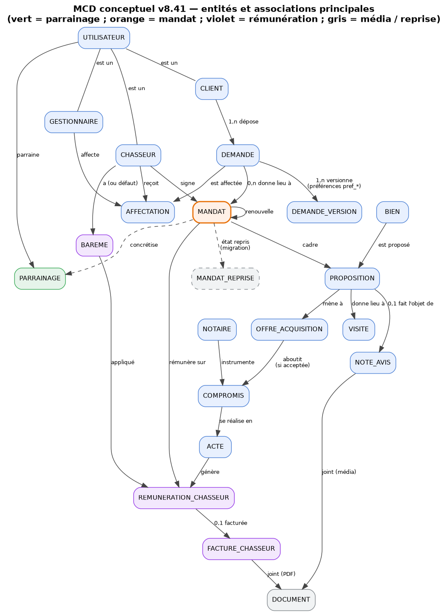
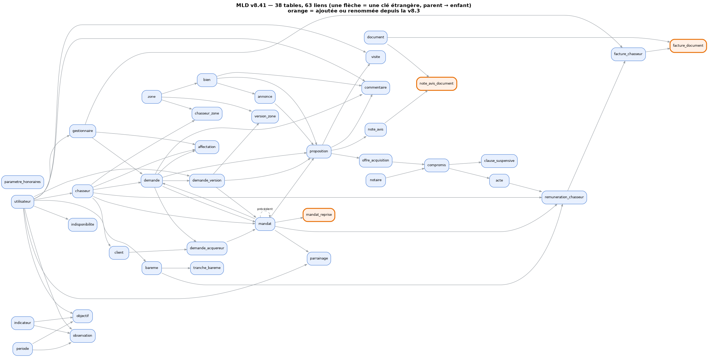

# Dossier de modélisation — v8.41 (autonome)

**Projet :** Service de chasse immobilière — refonte du SI
**Cible :** MPD v8.41 — `livrables/db/01_ddl.sql` + `livrables/db/02_triggers_vues.sql`, PostgreSQL 18 (compatible 16+)
**Date de référence projet :** 25 juillet 2026

> ⚠️ Entreprise, données et personnages fictifs. Livrable pédagogique (RNCP40573).

> **Document autonome.** Il décrit **l'intégralité** du modèle v8.41 (38 tables, 8 vues),
> sans renvoi à une version antérieure. Les décisions sont tracées par ADR. Le **sens métier** de chaque
> colonne est dans `dictionnaire-donnees-v841.md` ; l'**exhaustivité** (type, nullité, clés, règles) dans
> `dictionnaire-colonnes-v841.md`, généré depuis le DDL et vérifié automatiquement.

---

## 1. Le métier en une page

Un **particulier** (client acquéreur) confie à un **chasseur immobilier** la
recherche d'un bien, sous **mandat**. Le parcours :

1. Le client dépose une **demande** (ses critères de recherche).
2. Un **gestionnaire** affecte un **chasseur** à la demande.
3. Le chasseur et le client signent un **mandat** (l'engagement contractuel).
4. Le chasseur fait des **propositions** de biens, le client donne son avis.
5. Pour un bien retenu : **visite**, **note d'avis** du chasseur, puis **offre
   d'acquisition**.
6. Si l'offre est acceptée : **compromis** chez le **notaire**, puis **acte**
   authentique.
7. À l'encaissement des honoraires : **rémunération** du chasseur (selon un
   **barème**) et **facturation**.

Le **parrainage** permet à un client ou prospect d'apporter un filleul, contre
rétribution après concrétisation.

---

## 2. Principes de modélisation (transversaux)

| Principe | Application | ADR |
|---|---|---|
| Clés **UUIDv7** (ordonnées) | pas de fragmentation d'index à grande échelle | ADR-044 |
| **Le contractuel se rattache au mandat** | la proposition et la rémunération pointent le mandat (clés composées) ; la note d'avis pointe la proposition, donc indirectement le mandat | ADR-045, ADR-049 |
| L'**expression du besoin** reste sur la demande | critères, acquéreurs, affectation | — |
| **Si calculable, pas stocké** | aucun statut de progression : l'état du mandat, de la demande et du compromis est dérivé en vues ; seuls les faits et les écarts datés (résiliation, caducité, sans-suite) sont stockés | ADR-030, ADR-048 |
| **Reproductibilité temporelle** | `date_reference()` au lieu de `current_date` | ADR-047 |
| **Pas de DELETE physique** | cycle de vie par faits datés + anonymisation (jamais de suppression) | ADR-043, ADR-048 |
| **Le droit à rémunération se dérive de l'acte** | un acte est toujours une vente menée par le chasseur ; une vente externe ne crée pas d'acte (elle clôt le mandat) | ADR-049 |
| **Intention du client à 4 états** | critère `exige` / `souhaite` / `exclut` / `indifferent` (« sans balcon » = refus) | ADR-052 |
| Intégrité **déclarative** d'abord | FK composées, exclusions ; triggers si inter-lignes | ADR-045 |

---

## 3. MCD conceptuel — les entités et leurs liens

```mermaid
erDiagram
    UTILISATEUR ||--o| CLIENT : "est un"
    UTILISATEUR ||--o| CHASSEUR : "est un"
    UTILISATEUR ||--o| GESTIONNAIRE : "est un"
    CLIENT ||--o{ DEMANDE_ACQUEREUR : "figure dans"
    DEMANDE ||--|{ DEMANDE_ACQUEREUR : "a pour acquéreur"
    DEMANDE ||--|{ DEMANDE_VERSION : "versionne ses critères"
    GESTIONNAIRE ||--o{ AFFECTATION : "affecte"
    CHASSEUR ||--o{ AFFECTATION : "reçoit"
    DEMANDE ||--o{ AFFECTATION : "est affectée"
    DEMANDE ||--o{ MANDAT : "donne lieu à"
    CHASSEUR ||--o{ MANDAT : "signe"
    MANDAT ||--o| MANDAT : "renouvelle (précédent)"
    MANDAT ||--o| MANDAT_REPRISE : "état repris (migration)"
    MANDAT ||--o{ PROPOSITION : "cadre"
    DEMANDE ||--o{ PROPOSITION : "reçoit"
    BIEN ||--o{ PROPOSITION : "est proposé"
    BIEN ||--o{ ANNONCE : "a des annonces"
    PROPOSITION ||--o| NOTE_AVIS : "fait l'objet de"
    PROPOSITION ||--o{ VISITE : "donne lieu à"
    DEMANDE ||--o{ COMMENTAIRE : "est commentée"
    PROPOSITION ||--o{ COMMENTAIRE : "est commentée"
    BIEN ||--o{ COMMENTAIRE : "est annoté"
    NOTE_AVIS ||--o{ NOTE_AVIS_DOCUMENT : "joint"
    DOCUMENT ||--o{ NOTE_AVIS_DOCUMENT : "est joint à"
    FACTURE_CHASSEUR ||--o{ FACTURE_DOCUMENT : "joint"
    DOCUMENT ||--o{ FACTURE_DOCUMENT : "est joint à"
    PROPOSITION ||--o{ OFFRE_ACQUISITION : "mène à"
    OFFRE_ACQUISITION ||--o| COMPROMIS : "aboutit à"
    NOTAIRE ||--o{ COMPROMIS : "instrumente"
    COMPROMIS ||--o{ CLAUSE_SUSPENSIVE : "est assorti de"
    COMPROMIS ||--o| ACTE : "se réalise en"
    ACTE ||--o| REMUNERATION_CHASSEUR : "génère"
    MANDAT ||--o{ REMUNERATION_CHASSEUR : "rémunère sur"
    BAREME ||--|{ TRANCHE_BAREME : "découpé en"
    CHASSEUR ||--o{ BAREME : "a (ou défaut)"
    BAREME ||--o{ REMUNERATION_CHASSEUR : "est appliqué à"
    REMUNERATION_CHASSEUR ||--o| FACTURE_CHASSEUR : "facturée"
    UTILISATEUR ||--o{ PARRAINAGE : "parraine"
    MANDAT ||--o| PARRAINAGE : "concrétise"
```

**Lecture des liens structurants.** Un `utilisateur` est spécialisé en `client`,
`chasseur` ou `gestionnaire` (héritage par clé partagée). Une `demande` porte au
moins un acquéreur et au moins une version de critères. Elle peut donner lieu à
plusieurs `mandat` (renouvellements successifs, chaînés par `précédent`). Le
contractuel se rattache au `mandat` : la proposition et la rémunération le référencent directement
(clés étrangères composées), la note d'avis passe par la proposition. La
chaîne de vente est linéaire et verrouillée : `offre → compromis → acte`, chaque
étape conditionnée à la précédente (ADR-045).

---

## 4. MLD relationnel complet (38 tables)

Diagramme généré depuis les **clés étrangères du schéma réel** (une flèche = une clé étrangère, du parent
vers l'enfant). Le détail colonne par colonne est dans `dictionnaire-colonnes-v841.md` :

Six domaines : **acteurs** (utilisateur et spécialisations, parrainage),
**demande** (besoin, versions, affectation, zones), **biens** (bien, annonce,
proposition, note d'avis, documents), **vente** (offre, compromis, acte),
**rémunération** (barème, tranches, rémunération, facture), **pilotage**
(mandat, indicateurs, périodes, observations). Les tables à bordure orange
sont celles ajoutées ou renommées depuis la v8.3 : `mandat_reprise` (ex-`mandat_etat`, ADR-051),
`note_avis_document` et `facture_document` (remplacent le rattachement polymorphe, ADR-049).

---

## 5. Les domaines en détail

### 5.1 Acteurs
`utilisateur` est le tronc (identité, contact, authentification, anonymisation
RGPD). Trois spécialisations par clé partagée : `client` (profil acquéreur,
vigilance LCB-FT), `chasseur` (habilitation Hoguet — carte T ou attestation —,
garanties, barème par défaut), `gestionnaire` (matricule, capacité de leads).
`indisponibilite` trace les absences d'un chasseur. `parrainage` porte le
dispositif complet (parrain, filleul, cycle, rétribution).

### 5.2 Demande (expression du besoin)
`demande` est la racine du besoin (canal, consentement RGPD). **Aucun statut stocké** : le cycle est dérivé
(`v_demande`) ; seuls les faits et le flag « sans suite » sont persistés (ADR-048).
`demande_acquereur` lie un ou plusieurs clients (un principal obligatoire).
`demande_version` historise les critères (budget, surface, et des préférences à **4 états** `pref_*` :
exige / souhaite / exclut / indifferent, ADR-052).
`affectation` relie gestionnaire, demande et chasseur dans le temps.
`zone`/`version_zone`/`chasseur_zone` gèrent la géographie.

### 5.3 Biens et prospection
`bien` et ses `annonce` (sources hétérogènes). `proposition` relie un bien à une
demande **sous un mandat** (ADR-045). `commentaire` (une cible parmi
demande, proposition ou bien), `visite`, `note_avis` (conclusions du chasseur, **rattachées à la
proposition**), `document` (métadonnées ; octets hors base, ADR-042) relié aux notes et factures par
`note_avis_document` et `facture_document` (vraies clés étrangères).

### 5.4 Vente
Chaîne linéaire verrouillée : `offre_acquisition` (acceptée) → `compromis`
(réalisé, chez un `notaire`, avec `clause_suspensive`) → `acte` (encaissement
des honoraires tracé). Triggers d'intégrité (ADR-045). **Une vente externe** (mandat non exclusif, achat
ailleurs) ne crée pas d'acte : elle clôt le mandat (`type_resiliation = 'vente_externe'`, ADR-049).

### 5.5 Rémunération
`bareme` (défaut ou par chasseur, versionné, sans chevauchement) découpé en
`tranche_bareme` (intervalles semi-ouverts). `parametre_honoraires` (optionnel).
`remuneration_chasseur` (part **gelée** au jour de l'acte : toutes les valeurs obligatoires, les cinq
composantes du score conservées, taux final borné à 20–60 % par CHECK ; rattachée au mandat ET au
chasseur par FK composée). `facture_chasseur` (une seule facture par rémunération ; cycle soumise →
vérifiée → payée, vérification tracée).

### 5.6 Pilotage
`mandat` (le pivot contractuel) et `mandat_reprise` (état repris à la migration, donnée non recalculable,
ADR-051). `indicateur`/`periode`/`observation`/`objectif`
pour le suivi de performance (alimente l'OLAP, ADR-036).

---

## 6. Vues (logique dérivée, jamais stockée)

| Vue | Rôle |
|---|---|
| `v_mandat` | état du mandat dérivé des faits : `statut_calcule` ∈ actif / echu / clos_succes / renouvele / resilie ; un état repris (`mandat_reprise`) fait foi |
| `v_mandat_actif` | mandats dont l'état calculé est `actif` |
| `v_demande` | cycle de la demande : en_recherche / qualifie / affecte / close / sans_suite |
| `v_compromis` | état du compromis : signe / realise / caduc |
| `v_version_courante` | version de critères en vigueur par demande (`no_version` maximal) |
| `v_honoraires` | assiette d'honoraires par acte (arrondie) |
| `v_conformite_chasseur` | habilitation/RCP expirée, `est_a_regulariser` (D-FLAG) |
| `v_charge_gestionnaire` | charge de leads par gestionnaire |

---

## 7. Dictionnaire des données

Le détail colonne par colonne (sens, domaine, justification, contraintes) figure
dans `dictionnaire-donnees-v841.md` (sens métier) et `dictionnaire-colonnes-v841.md` (référentiel exhaustif généré).

---

## 8. Rattachement RNCP40573

| Bloc | Contribution |
|---|---|
| BC01 | Modèle conceptuel et logique complet, décisions tracées (ADR) |
| BC03 | MLD aligné sur le DDL réel ; intégrité portée par le SGBD |
| BC05 | Socle dimensionné et cohérent pour l'aval analytique/IA |
