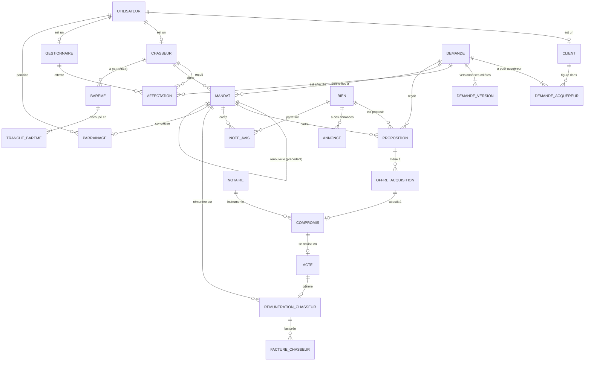

# Dossier de modélisation — v8.41 (autonome)

**Projet :** Service de chasse immobilière — refonte du SI
**Cible :** MPD v8.41 — `sql/01_ddl.sql` + `sql/02_triggers_vues.sql`, PostgreSQL 18 (compatible 16+)
**Date de référence projet :** 25 juillet 2026

> ⚠️ Entreprise, données et personnages fictifs. Livrable pédagogique (RNCP40573).

> **Document autonome.** Il décrit **l'intégralité** du modèle v8.41 (36 tables),
> sans renvoi à une version antérieure. Les décisions sont tracées par ADR.

---

## 1. Le métier en une page

Un **particulier** (client acquéreur) confie à un **chasseur immobilier** la
recherche d'un bien, sous **mandat**. Le parcours :

1. Le client dépose une **demande** (ses critères de recherche).
2. Un **gestionnaire** affecte un **chasseur** à la demande.
3. Le chasseur et le client signent un **mandat** (l'engagement contractuel).
4. Le chasseur fait des **propositions** de biens, le client donne son avis.
5. Pour un bien retenu : **visite**, **note d'avis** du chasseur, puis **offre
   d'acquisition**.
6. Si l'offre est acceptée : **compromis** chez le **notaire**, puis **acte**
   authentique.
7. À l'encaissement des honoraires : **rémunération** du chasseur (selon un
   **barème**) et **facturation**.

Le **parrainage** permet à un client ou prospect d'apporter un filleul, contre
rétribution après concrétisation.

---

## 2. Principes de modélisation (transversaux)

| Principe | Application | ADR |
|---|---|---|
| Clés **UUIDv7** (ordonnées) | pas de fragmentation d'index à grande échelle | ADR-044 |
| **Le contractuel se rattache au mandat** | note d'avis, rémunération, proposition pointent le mandat | ADR-045 |
| L'**expression du besoin** reste sur la demande | critères, acquéreurs, affectation | — |
| **Si calculable, pas stocké** | expiration mandat, conformité → vues | ADR-030 |
| **Reproductibilité temporelle** | `date_reference()` au lieu de `current_date` | ADR-047 |
| **Pas de DELETE physique** | cycle de vie par statuts + anonymisation | ADR-043 |
| Intégrité **déclarative** d'abord | FK composées, exclusions ; triggers si inter-lignes | ADR-045 |

---

## 3. MCD conceptuel — les entités et leurs liens

**Lecture des liens structurants.** Un `utilisateur` est spécialisé en `client`,
`chasseur` ou `gestionnaire` (héritage par clé partagée). Une `demande` porte au
moins un acquéreur et au moins une version de critères. Elle peut donner lieu à
plusieurs `mandat` (renouvellements successifs, chaînés par `précédent`). Tout le
contractuel (proposition, note d'avis, rémunération) se rattache au `mandat`. La
chaîne de vente est linéaire et verrouillée : `offre → compromis → acte`, chaque
étape conditionnée à la précédente (ADR-045).

---

## 4. MLD relationnel complet (36 tables)

Diagramme généré depuis le schéma réel, groupé par domaine, avec cardinalités :

Six domaines : **acteurs** (utilisateur et spécialisations, parrainage),
**demande** (besoin, versions, affectation, zones), **biens** (bien, annonce,
proposition, note d'avis, documents), **vente** (offre, compromis, acte),
**rémunération** (barème, tranches, rémunération, facture), **pilotage**
(mandat, indicateurs, périodes, observations). Les 8 tables à bordure épaisse
sont les nouveautés de la chaîne rémunération et médias.

---

## 5. Les domaines en détail

### 5.1 Acteurs
`utilisateur` est le tronc (identité, contact, authentification, anonymisation
RGPD). Trois spécialisations par clé partagée : `client` (profil acquéreur,
vigilance LCB-FT), `chasseur` (habilitation Hoguet — carte T ou attestation —,
garanties, barème par défaut), `gestionnaire` (matricule, capacité de leads).
`indisponibilite` trace les absences d'un chasseur. `parrainage` porte le
dispositif complet (parrain, filleul, cycle, rétribution).

### 5.2 Demande (expression du besoin)
`demande` est la racine du besoin (canal, consentement RGPD, statut de cycle).
`demande_acquereur` lie un ou plusieurs clients (un principal obligatoire).
`demande_version` historise les critères (booléens d'exigence, budget, surface).
`affectation` relie gestionnaire, demande et chasseur dans le temps.
`zone`/`version_zone`/`chasseur_zone` gèrent la géographie.

### 5.3 Biens et prospection
`bien` et ses `annonce` (sources hétérogènes). `proposition` relie un bien à une
demande **sous un mandat** (ADR-045). `commentaire` (échanges), `visite`,
`note_avis` (conclusions du chasseur, rattachées au mandat), `document` +
`document_rattachement` (médias hors base, ADR-042).

### 5.4 Vente
Chaîne linéaire verrouillée : `offre_acquisition` (acceptée) → `compromis`
(réalisé, chez un `notaire`, avec `clause_suspensive`) → `acte` (encaissement
des honoraires tracé). Triggers d'intégrité (ADR-045).

### 5.5 Rémunération
`bareme` (défaut ou par chasseur, versionné, sans chevauchement) découpé en
`tranche_bareme` (intervalles semi-ouverts). `parametre_honoraires` (optionnel).
`remuneration_chasseur` (part **gelée** au jour de l'acte, rattachée au mandat
ET au chasseur par FK composée). `facture_chasseur` (cycle soumise → vérifiée →
payée).

### 5.6 Pilotage
`mandat` (le pivot contractuel). `indicateur`/`periode`/`observation`/`objectif`
pour le suivi de performance (alimente l'OLAP, ADR-036).

---

## 6. Vues (logique dérivée, jamais stockée)

| Vue | Rôle |
|---|---|
| `v_mandat` | date de fin et expiration calculées (6 mois, `date_reference()`) |
| `v_mandat_actif` | mandats non expirés |
| `v_honoraires` | assiette d'honoraires par acte (arrondie) |
| `v_version_courante` | version de critères en vigueur par demande |
| `v_conformite_chasseur` | habilitation/RCP expirée, `est_a_regulariser` (D-FLAG) |
| `v_charge_gestionnaire` | charge de leads par gestionnaire |

---

## 7. Dictionnaire des données

Le détail colonne par colonne (sens, domaine, justification, contraintes) figure
dans `dictionnaire-donnees-v82.md`.

---

## 8. Rattachement RNCP40573

| Bloc | Contribution |
|---|---|
| BC01 | Modèle conceptuel et logique complet, décisions tracées (ADR) |
| BC03 | MLD aligné sur le DDL réel ; intégrité portée par le SGBD |
| BC05 | Socle dimensionné et cohérent pour l'aval analytique/IA |
